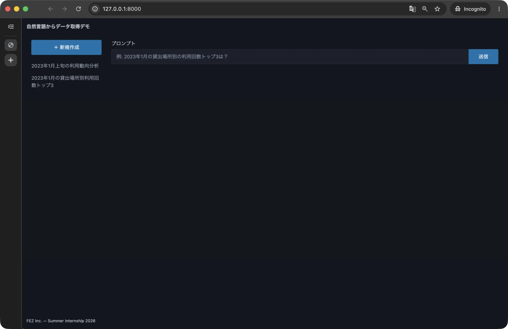

# 第 0 章: 事前準備

この章では、macOS に開発環境を用意し、自分の Google Cloud プロジェクトで完成アプリを動かします。これから作るアプリの動きを、先に確かめましょう。

## 0.1 アプリをインストールする

macOS のターミナルを開き、[Homebrew](https://brew.sh/ja/) をインストールします。

```bash
/bin/bash -c "$(curl -fsSL https://raw.githubusercontent.com/Homebrew/install/HEAD/install.sh)"
```

インストール後に `Next steps` が表示された場合は、そのコマンドを実行してから続けてください。

```bash
brew install git uv
brew install --cask --adopt google-chrome
brew install --cask --adopt visual-studio-code
```

以降は VS Code の「ターミナル」から「新しいターミナル」を開いて操作します。

## 0.2 教材を配置する

次のコマンドで公開リポジトリを clone し、教材を `~/Projects/fez-2026-summer-intern-public` に取得します。

```bash
mkdir -p ~/Projects
cd ~/Projects
git clone https://github.com/fez-inc-jp/fez_2026_summer_intern_public.git fez-2026-summer-intern-public
cd fez-2026-summer-intern-public
ls
code .
```

> [!NOTE]
> 以下の手順書では、`~/Projects/fez-2026-summer-intern-public` を教材のパスとして記述していますが、clone する場所や clone したリポジトリのディレクトリ名はお好きなものに変更していただいて問題ありません。

`README.md`、`docs/`、`hands-on/`、`reference/` が見えることを確認します。

次のコマンドで、作業状態と取得したコミットの履歴を確認します。

```bash
git status
git log -1 --oneline
```

`On branch main` と `nothing to commit, working tree clean` が表示されることを確認します。第 1 章からは、ローカルの `main` ブランチで実装を進めます。

コミット時に名前・メールアドレスの設定を求められた場合は、このリポジトリに記録する自分の値を `git config user.name` と `git config user.email` で設定してください。これらは認証用のパスワードやトークンを設定する操作ではありません。

## 0.3 Google Cloud を準備する

これから作るアプリでは、Google Cloud の BigQuery で公開データを集計し、Gemini で SQL や集計結果の要約を作ります。この節では、自分の Google アカウントでこれらを利用できるように準備します。

まず、教材専用の「プロジェクト」を作り、支払い方法を設定します。プロジェクトは、利用するサービスや設定をまとめて管理する単位です。その後、必要なサービスを有効にし、自分の PC から接続するためのログインとアプリの設定を行います。

### 0.3.1 自分のプロジェクトを作る

1. 自分の Google アカウントで [Google Cloud コンソール](https://console.cloud.google.com/) にログインする
2. 上部のプロジェクト選択から「新しいプロジェクト」を開き、教材専用のプロジェクトを作成する
3. 表示名とは別の「プロジェクト ID」を控える。以後の `YOUR_PROJECT_ID` は、この ID に置き換える
4. 「お支払い」で自分の課金アカウントを作成または選択し、教材用プロジェクトへ関連付ける
5. BigQuery と Gemini の料金を確認し、自分の利用上限を決める

プロジェクト作成は [公式手順](https://docs.cloud.google.com/resource-manager/docs/creating-managing-projects) を参照してください。組織アカウントで作成や課金の操作が制限されている場合は、そのアカウントの管理者に確認してください。

アプリはローカルで動きますが、BigQuery のクエリと Gemini の呼び出しは課金対象になる場合があります。Google Cloud の無料枠・クレジットの適用は各アカウントの条件によるため、教材全体を無条件に無料で利用できるわけではないことに注意してください。

> [!WARNING]
> すでに仕事などで Google Cloud を使っている場合は、非公開データにアクセスできるアカウントをこの教材には使わないでください。教材専用のプロジェクトを新しく作っても、そのアカウントがほかのデータを読める状態は変わりません。そのため、既に利用しているアカウントがある場合は注意し、必要に応じて異なるアカウントで進めるようにしてください。

### 0.3.2 CLI と API

```bash
brew install --cask gcloud-cli
gcloud auth login
```

ブラウザで、先ほどプロジェクトを作成したアカウントを選択します。

```bash
export PROJECT_ID=YOUR_PROJECT_ID
gcloud config set project "$PROJECT_ID"
gcloud projects describe "$PROJECT_ID" --format='value(projectId)'
gcloud services enable bigquery.googleapis.com aiplatform.googleapis.com --project="$PROJECT_ID"
```

最後のコマンドは BigQuery と Gemini の API を有効にします。`aiplatform.googleapis.com` は Google Cloud 上で Gemini を利用する API です。

### 0.3.3 アプリの認証

CLI とアプリの認証をそれぞれ用意します。CLI のログインだけでは Python ライブラリ用の認証情報を用意したことになりません。

```bash
gcloud auth application-default login
gcloud auth application-default set-quota-project "$PROJECT_ID"
```

アプリ用の認証情報を ADC と呼びます。完成アプリの Docker Compose は、ホストの `~/.config/gcloud` を読み取り専用でマウントして ADC を使います。

認証情報、ADC ファイル、サービスアカウントの秘密鍵を教材フォルダへコピーしないでください。

### 0.3.4 権限

プロジェクトを作成したアカウントが必要な権限を持つ場合、同じ権限の追加付与は不要です。別のアカウントで実行する場合は、管理者が用途に応じて確認します。

| 用途 | ロールの例 |
|---|---|
| API を有効化する | Service Usage Admin (`roles/serviceusage.serviceUsageAdmin`) |
| BigQuery のジョブを実行する | BigQuery Job User (`roles/bigquery.jobUser`) |
| Gemini を呼び出す | Agent Platform User (`roles/aiplatform.user`) |
| quota project を使用する | Service Usage Consumer (`roles/serviceusage.serviceUsageConsumer`) |

公開データのプロジェクトへロールを付ける操作は行いません。ジョブ実行と課金は自分のプロジェクト、データの参照は公開テーブルという役割を区別しましょう。

### 0.3.5 設定ファイル

```bash
cd ~/Projects/fez-2026-summer-intern-public/reference
cp .env.example .env
code .env
```

`.env` の `BIGQUERY_PROJECT_ID` と `GEMINI_PROJECT_ID` を自分のプロジェクト ID に置き換えます。初回は両方とも同じプロジェクトを使います。

`BIGQUERY_LOCATION` は採用データのロケーション、`GEMINI_LOCATION` はモデルの提供先に合わせます。プロジェクト ID に `bigquery-public-data` を指定しないでください。

Docker の準備後、第 0.5 節で設定を検査してから起動します。

### 0.3.6 つまずいたとき

| 症状 | 確認すること |
|---|---|
| プロジェクトが見つからない | 表示名ではなく ID を指定したか、同じアカウントでログインしたか |
| API が未有効というエラー | 対象プロジェクトで必要な API と課金設定を有効にしたか |
| ADC が見つからない・再認証が必要 | ホストで `gcloud auth application-default login` を実行したか |
| quota project の権限エラー | `roles/serviceusage.serviceUsageConsumer` と `set-quota-project` を確認 |
| テーブルが別ロケーションにあるというエラー | 採用テーブルの場所と `BIGQUERY_LOCATION` が一致するか |
| 設定値を変えても反映されない | Compose の起動ディレクトリと `.env` を確認して再起動する |

## 0.4 Docker を準備する

Docker は第 2 章で説明します。この章では完成アプリを動かすために使います。

```bash
brew install colima docker docker-buildx docker-compose docker-credential-helper
mkdir -p ~/.docker/cli-plugins
ln -sfn "$(brew --prefix)/lib/docker/cli-plugins/docker-buildx" ~/.docker/cli-plugins/docker-buildx
ln -sfn "$(brew --prefix)/lib/docker/cli-plugins/docker-compose" ~/.docker/cli-plugins/docker-compose
colima start
```

## 0.5 完成アプリを動かす

```bash
cd ~/Projects/fez-2026-summer-intern-public/reference
docker compose config --quiet
docker compose up --build
```

`Application startup complete.` と表示されたら、[http://127.0.0.1:8000/](http://127.0.0.1:8000/) を開きます。



次の質問を送信し、表・要約・実行した SQL が表示されることを確認します。

```text
2023年1月の貸出場所別の利用回数トップ3を教えて
```

この例題は [Austin の公開データ](./data.md) を使います。結果が毎回同じ文章になる必要はありませんが、SQL が `bigquery-public-data.austin_bikeshare.bikeshare_trips` を参照し、3 件の結果が表示されることを確認してください。

続けて「今日の天気を教えて」と入力すると、利用可能なデータでは回答できない旨が表示されます。天気のデータはこの教材のテーブルに含まれません。

## 0.6 終了する

ターミナルで `Control + C` を押してから、コンテナを停止します。

```bash
docker compose down
colima stop
```

履歴はボリュームに残ります。第 1 章からは、完成形の `reference/` を残したまま、同じリポジトリ内の空の `hands-on/` で作り始めます。
