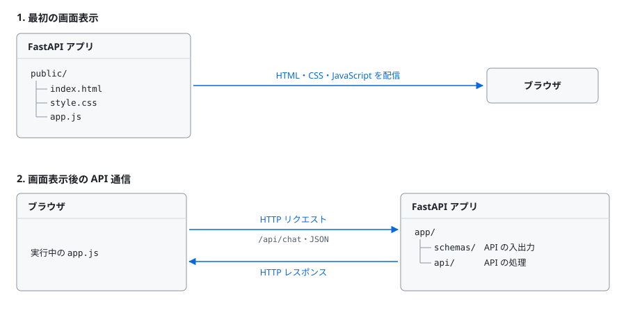
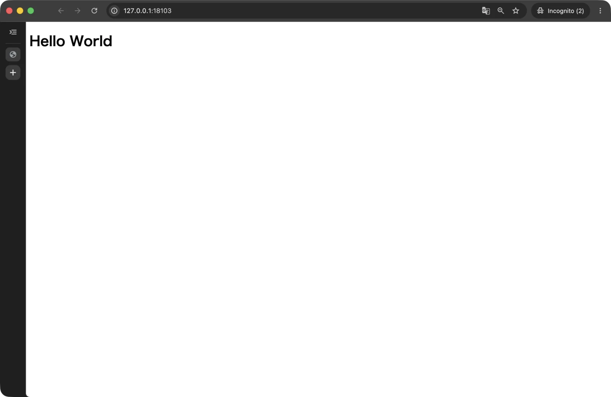
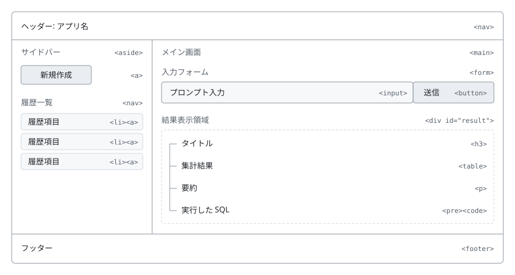
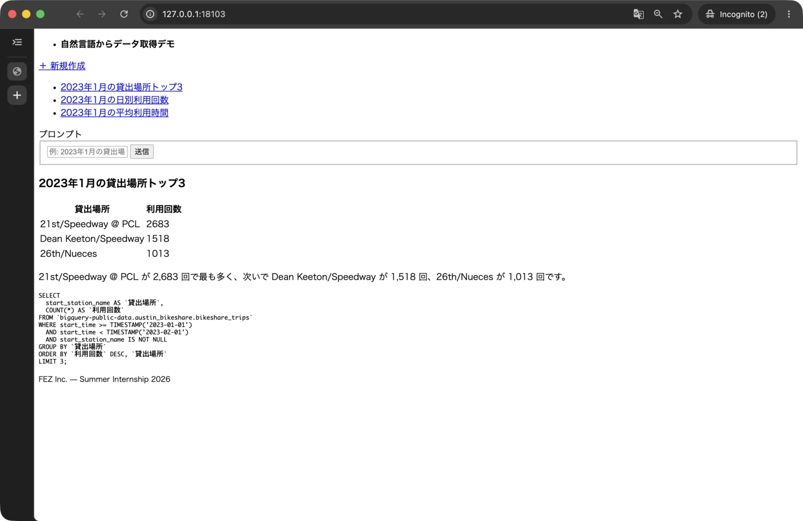
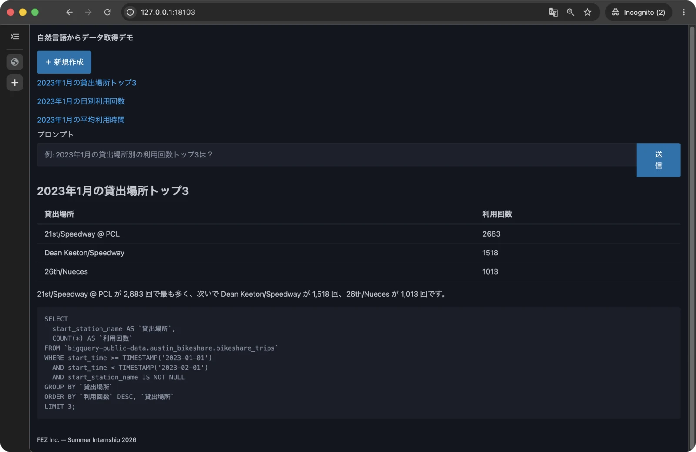
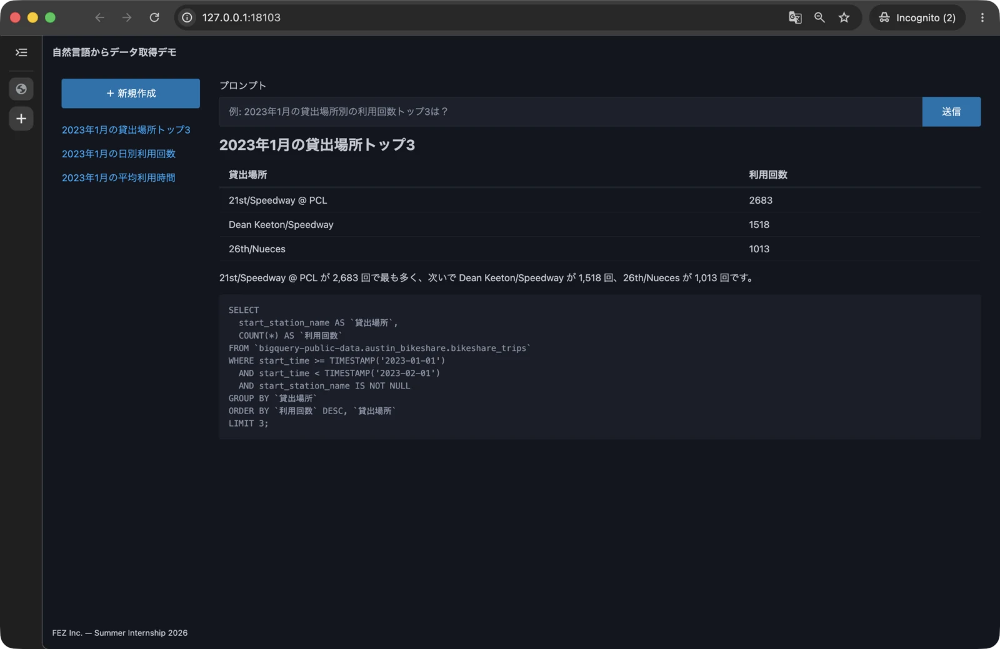
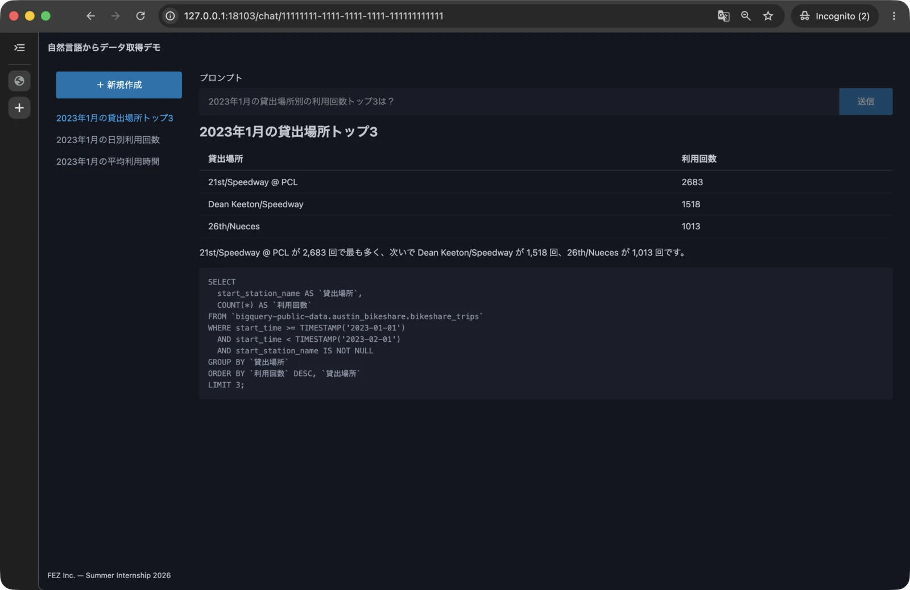

# 第 1 章: モックデータで動作するアプリ

この章では、固定のモックデータを返す API と、そのデータを表示する画面を作ります。
実際のデータベースや外部サービスへ接続する前に、ブラウザからバックエンドを呼び出し、結果を表示するまでの流れを一周させましょう。

- この章でやること
  - Git のコミットを使って変更を管理する
  - FastAPI で API と静的ファイルを配信する
  - HTML と CSS で画面を作る
  - SQLModel で API の入出力を定義する
  - JavaScript の `fetch` で API を呼び出す
  - URL と表示内容を連動させる
- この章ではやらないこと
  - データベースへの保存
  - BigQuery や LLM との接続
  - ローディング表示やエラー表示

画面を開いてから結果が表示されるまで、次の順に処理されます。

1. Chrome が FastAPI から HTML、CSS、JavaScript を読み込む
2. JavaScript が FastAPI の API へ HTTP リクエストを送る
3. API がモックデータを JSON で返す
4. JavaScript が JSON をもとに画面を更新する

章の最後には、チャットの一覧・詳細・新規作成をブラウザから操作できる状態になります。

## 1.1 Git でコードを管理する

第 0 章で用意したリポジトリの `main` ブランチで、`hands-on/` に直接実装します。完成アプリは同じリポジトリの `reference/` に残し、必要に応じて答え合わせに使います。

```bash
cd ~/Projects/fez-2026-summer-intern-public
git status
```

`On branch main` と表示されることを確認します。第 1〜7 章の実装場所は `~/Projects/fez-2026-summer-intern-public/hands-on/` です。各節の変更をコミットし、章の最後に履歴を確認します。

この教材ではローカルでコミットして進捗を残します。公開元への書き込み権限やリモートへの push は不要です。コミットメッセージは、変更の種類を表す prefix と説明を組み合わせます。

```text
chore: Python プロジェクトを初期化
feat: Hello World を表示
feat: 静的な画面を追加
feat: モック API を追加
feat: フロントエンドとモック API を接続
```

## 1.2 プロジェクトの土台を作る

このアプリでは、フロントエンドの静的ファイルとバックエンドの API を、どちらも [FastAPI](https://fastapi.tiangolo.com/) から配信します。FastAPI は Python で API を作るためによく使われるフレームワークですが、今回は HTML、CSS、JavaScript を配信する Web サーバーとしても利用します。

フロントエンドとバックエンドを 1 つの FastAPI アプリにまとめることで、1 つのサーバーを通じて画面と API の両方へアクセスできるようにします。

Python とパッケージを管理する [uv](https://docs.astral.sh/uv/) をインストールします。

```bash
brew install uv
```

この教材で実装する `hands-on` ディレクトリへ移動し、Python プロジェクトを初期化します。

```bash
cd ~/Projects/fez-2026-summer-intern-public/hands-on
rm .gitkeep
uv init --bare --name public-data-analysis-hands-on --python 3.13
uv add "fastapi[standard]" sqlmodel
```

`pyproject.toml` には Python のバージョンと利用するパッケージが記録され、`uv.lock` には実際にインストールするパッケージのバージョンが記録されます。

続いて、バックエンドとフロントエンドのディレクトリを作ります。

```bash
mkdir -p app/api app/schemas public
touch app/__init__.py app/api/__init__.py app/schemas/__init__.py
```

この時点の主な構成は次のとおりです。

```text
hands-on/
├── app/                    # FastAPI アプリ
│   ├── __init__.py
│   ├── api/                # API のエンドポイント
│   │   └── __init__.py
│   └── schemas/            # API の入出力
│       └── __init__.py
├── public/                 # HTML、CSS、JavaScript
├── pyproject.toml          # Python と依存パッケージの設定
└── uv.lock                 # 依存パッケージのバージョン
```

一般的にディレクトリ構成は役割ごとに管理しやすくなるようにアプリの規模や開発体制に応じて決めます。今回は、フロントエンドで用いるファイル群は少ないため `public/` の一箇所にまとめ、バックエンドについてはさまざまな処理を実装するので役割ごとにディレクトリを作成しています。なお、この章ではバックエンドのサブディレクトリは `api/` と `schemas/` のみですが以降もいくつかディレクトリを追加します。

以下に、この後の節で作成するファイルも含めた完成時の挙動を示します。



ここまでの変更をコミットします。

```bash
cd ~/Projects/fez-2026-summer-intern-public/hands-on
git add .
git commit -m "chore: Python プロジェクトを初期化"
```

## 1.3 FastAPI から Hello World を表示する

はじめに、FastAPI から HTML を配信する最小構成を作ります。`app/main.py` を作成し、次の内容を記述します。

```python
from fastapi import FastAPI

app = FastAPI()

app.frontend("/", directory="public", fallback="index.html")
```

`public/index.html` を作成します。

```html
<!doctype html>
<html lang="ja">
  <head>
    <meta charset="utf-8" />
    <meta name="viewport" content="width=device-width, initial-scale=1" />
    <title>自然言語からデータ取得デモ</title>
  </head>
  <body>
    <h1>Hello World</h1>
  </body>
</html>
```

`hands-on` ディレクトリで開発サーバーを起動します。

```bash
uv run fastapi dev app/main.py
```

`Application startup complete.` と表示されたら、Chrome で [http://127.0.0.1:8000/](http://127.0.0.1:8000/) を開きます。`Hello World` と表示されれば、FastAPI から HTML を配信できています。



サーバーはこの後も起動したままにします。以降のコマンドは、VS Code でもう 1 つターミナルを開いて実行してください。ファイルを保存すると、開発サーバーが変更を自動で読み込みます。その後、Chrome を再読み込みすることで変更内容がブラウザ側にも反映されます。

新しいターミナルを開いたらディレクトリを移動するのを忘れないようにしましょう。

```bash
cd ~/Projects/fez-2026-summer-intern-public/hands-on
```

ここまでの変更をコミットします。

```bash
cd ~/Projects/fez-2026-summer-intern-public/hands-on
git add app/main.py
git add public/index.html
git commit -m "feat: Hello World を表示"
```

## 1.4 静的な画面を作る

API と接続する前に、完成形の骨組みを HTML と CSS で作ります。この時点では、結果のデータを HTML に直接記述します。

### 1.4.1 HTML で画面の骨組みを作る

はじめに、完成画面の配置をワイヤーフレームで確認します。



画面上部を `nav`、中央の 2 列を `div.layout`、左側を `aside`、右側を `main`、最下部を `footer` として実装します。`main` の中には入力用の `form` と結果表示用の `div` を配置します。この節では CSS を使わず、HTML の構造だけを作ります。

まず `public/index.html` を、ヘッダー、本文、フッターだけの構成に置き換えます。

```html
<!doctype html>
<html lang="ja">
  <head>
    <meta charset="utf-8" />
    <meta name="viewport" content="width=device-width, initial-scale=1" />
    <title>自然言語からデータ取得デモ</title>
  </head>
  <body>
    <nav>
      <ul>
        <li><strong>自然言語からデータ取得デモ</strong></li>
      </ul>
    </nav>

    <div class="layout"></div>

    <footer>
      <small>FEZ Inc. — Summer Internship 2026</small>
    </footer>
  </body>
</html>
```

次に、空の `<div class="layout"></div>` を、チャット履歴とメイン画面に置き換えます。メイン画面には入力フォームと、後ほど結果を書き込む空の `div` を用意します。

```html
<div class="layout">
  <aside>
    <a href="/" id="new-chat">＋ 新規作成</a>
    <nav>
      <ul id="chat-list">
        <li>
          <a href="/chat/11111111-1111-1111-1111-111111111111">2023年1月の貸出場所トップ3</a>
        </li>
        <li>
          <a href="/chat/22222222-2222-2222-2222-222222222222">2023年1月の日別利用回数</a>
        </li>
        <li>
          <a href="/chat/33333333-3333-3333-3333-333333333333">2023年1月の平均利用時間</a>
        </li>
      </ul>
    </nav>
  </aside>
  <main>
    <form id="data-fetch-form">
      <label for="prompt">プロンプト</label>
      <fieldset role="group">
        <input
          type="text"
          id="prompt"
          name="prompt"
          placeholder="例: 2023年1月の貸出場所別の利用回数トップ3は？"
        />
        <button type="submit" id="prompt-submit">送信</button>
      </fieldset>
    </form>

    <div id="result"></div>
  </main>
</div>
```

最後に、空の `<div id="result"></div>` へ、モックのタイトル、表、要約、SQL を追加します。

```html
<div id="result">
  <h3>2023年1月の貸出場所トップ3</h3>
  <table>
    <thead>
      <tr>
        <th>貸出場所</th>
        <th>利用回数</th>
      </tr>
    </thead>
    <tbody>
      <tr>
        <td>21st/Speedway @ PCL</td>
        <td>2683</td>
      </tr>
      <tr>
        <td>Dean Keeton/Speedway</td>
        <td>1518</td>
      </tr>
      <tr>
        <td>26th/Nueces</td>
        <td>1013</td>
      </tr>
    </tbody>
  </table>
  <p>21st/Speedway @ PCL が 2,683 回で最も多く、次いで Dean Keeton/Speedway が 1,518 回、26th/Nueces が 1,013 回です。</p>
  <pre><code>SELECT
  start_station_name AS `貸出場所`,
  COUNT(*) AS `利用回数`
FROM `bigquery-public-data.austin_bikeshare.bikeshare_trips`
WHERE start_time &gt;= TIMESTAMP(&#x27;2023-01-01&#x27;)
  AND start_time &lt; TIMESTAMP(&#x27;2023-02-01&#x27;)
  AND start_station_name IS NOT NULL
GROUP BY `貸出場所`
ORDER BY `利用回数` DESC, `貸出場所`
LIMIT 3;</code></pre>
</div>
```

ここまでを組み合わせると、`public/index.html` 全体は次のようになります。

```html
<!doctype html>
<html lang="ja">
  <head>
    <meta charset="utf-8" />
    <meta name="viewport" content="width=device-width, initial-scale=1" />
    <title>自然言語からデータ取得デモ</title>
  </head>
  <body>
    <nav>
      <ul>
        <li><strong>自然言語からデータ取得デモ</strong></li>
      </ul>
    </nav>

    <div class="layout">
      <aside>
        <a href="/" id="new-chat">＋ 新規作成</a>
        <nav>
          <ul id="chat-list">
            <li>
              <a href="/chat/11111111-1111-1111-1111-111111111111">2023年1月の貸出場所トップ3</a>
            </li>
            <li>
              <a href="/chat/22222222-2222-2222-2222-222222222222">2023年1月の日別利用回数</a>
            </li>
            <li>
              <a href="/chat/33333333-3333-3333-3333-333333333333">2023年1月の平均利用時間</a>
            </li>
          </ul>
        </nav>
      </aside>
      <main>
        <form id="data-fetch-form">
          <label for="prompt">プロンプト</label>
          <fieldset role="group">
            <input
              type="text"
              id="prompt"
              name="prompt"
              placeholder="例: 2023年1月の貸出場所別の利用回数トップ3は？"
            />
            <button type="submit" id="prompt-submit">送信</button>
          </fieldset>
        </form>

        <div id="result">
          <h3>2023年1月の貸出場所トップ3</h3>
          <table>
            <thead>
              <tr>
                <th>貸出場所</th>
                <th>利用回数</th>
              </tr>
            </thead>
            <tbody>
              <tr>
                <td>21st/Speedway @ PCL</td>
                <td>2683</td>
              </tr>
              <tr>
                <td>Dean Keeton/Speedway</td>
                <td>1518</td>
              </tr>
              <tr>
                <td>26th/Nueces</td>
                <td>1013</td>
              </tr>
            </tbody>
          </table>
          <p>21st/Speedway @ PCL が 2,683 回で最も多く、次いで Dean Keeton/Speedway が 1,518 回、26th/Nueces が 1,013 回です。</p>
          <pre><code>SELECT
  start_station_name AS `貸出場所`,
  COUNT(*) AS `利用回数`
FROM `bigquery-public-data.austin_bikeshare.bikeshare_trips`
WHERE start_time &gt;= TIMESTAMP(&#x27;2023-01-01&#x27;)
  AND start_time &lt; TIMESTAMP(&#x27;2023-02-01&#x27;)
  AND start_station_name IS NOT NULL
GROUP BY `貸出場所`
ORDER BY `利用回数` DESC, `貸出場所`
LIMIT 3;</code></pre>
        </div>
      </main>
    </div>

    <footer>
      <small>FEZ Inc. — Summer Internship 2026</small>
    </footer>
  </body>
</html>
```

Chrome を再読み込みし、ヘッダー、チャット履歴、入力フォーム、結果、フッターが、装飾されていない状態で表示されることを確認します。



### 1.4.2 CSS で画面を整える

デザインにかける時間を抑えるため、[Pico CSS](https://picocss.com/) を利用します。Pico CSS は、HTML の要素へ基本的なデザインを適用する CSS フレームワークです。

`public/index.html` の `head` に、Pico CSS と独自の `style.css` を読み込む次のコードを追加します。独自 CSS で Pico CSS を調整できるように、`style.css` は後から読み込みます。

```html
<meta name="color-scheme" content="light dark" />
<link
  rel="stylesheet"
  href="https://cdn.jsdelivr.net/npm/@picocss/pico@2/css/pico.min.css"
/>
<link rel="stylesheet" href="/style.css" />
```

続いて、`body` に Pico CSS の `container-fluid` を指定し、新規作成リンクへボタンの見た目を適用します。

```html
<body class="container-fluid">
```

```html
<a href="/" role="button" id="new-chat">＋ 新規作成</a>
```

Pico CSS は要素や class を元にある程度自動でデザインを調整してくれますが、現時点ではところどころデザインが崩れていたり、サイドバーが意図した位置になかったりしているはずです。これらを修正するために少しだけ自前で CSS を書いていきましょう。



`public/style.css` を作成します。

```css
:root {
  --pico-font-size: 87.5%;
}

body {
  display: grid;
  grid-template-rows: auto 1fr auto;
  gap: var(--pico-spacing);
  height: 100dvh;
}

.layout {
  display: grid;
  grid-template-columns: 230px 1fr;
  min-height: 0;
}

.layout > aside,
.layout > main {
  min-height: 0;
  overflow-y: auto;
  padding-inline: var(--pico-spacing);
}

#new-chat {
  display: block;
  margin-bottom: var(--pico-spacing);
}

#prompt-submit {
  white-space: nowrap;
}

@media (max-width: 768px) {
  body {
    height: auto;
  }

  .layout {
    grid-template-columns: 1fr;
  }
}
```

Chrome を再読み込みし、左側に履歴、右側に入力フォームと結果が表示されることを確認します。ウィンドウの幅を狭くしたときは、履歴とメイン画面が縦に並びます。きれいになりましたね！



ここまでの変更をコミットします。

```bash
cd ~/Projects/fez-2026-summer-intern-public/hands-on
git add public
git commit -m "feat: 静的な画面を追加"
```

## 1.5 モック API を設計・実装する

この章では Austin の公開データを題材に、2023 年 1 月の貸出場所別の利用回数トップ 3 を固定値として表示します。SQL は表示用で、この章では BigQuery に接続しません。日別利用回数や平均利用時間の履歴も画面確認用の項目であり、選択しても同じ固定結果を返します。実データへの問い合わせは第 4 章で実装します。

現在は HTML に結果を直接書いています。これを API から受け取るため、画面に必要なデータを JSON で表します。

```json
{
  "id": "11111111-1111-1111-1111-111111111111",
  "title": "2023年1月の貸出場所トップ3",
  "prompt": "2023年1月の貸出場所別の利用回数トップ3は？",
  "result": {
    "columns": ["貸出場所", "利用回数"],
    "rows": [["21st/Speedway @ PCL", 2683], ["Dean Keeton/Speedway", 1518], ["26th/Nueces", 1013]],
    "summary": "21st/Speedway @ PCL が 2,683 回で最も多く、次いで Dean Keeton/Speedway が 1,518 回、26th/Nueces が 1,013 回です。",
    "sql": "SELECT\n  start_station_name AS `貸出場所`,\n  COUNT(*) AS `利用回数`\nFROM `bigquery-public-data.austin_bikeshare.bikeshare_trips`\nWHERE start_time >= TIMESTAMP('2023-01-01')\n  AND start_time < TIMESTAMP('2023-02-01')\n  AND start_station_name IS NOT NULL\nGROUP BY `貸出場所`\nORDER BY `利用回数` DESC, `貸出場所`\nLIMIT 3;"
  }
}
```

JSON は、フロントエンドとバックエンドが受け渡す際に用いるデータの形式です。この形式を先に決めることで、両者が同じ名前と構造を使って実装できます。

### 1.5.1 API の入出力を定義する

`app/schemas/chat.py` を作成します。

```python
from uuid import UUID

from sqlmodel import SQLModel

Cell = str | int | float | bool | None


class ChatResult(SQLModel):
    columns: list[str]
    rows: list[list[Cell]]
    summary: str
    sql: str


class ChatPublic(SQLModel):
    id: UUID
    title: str
    prompt: str
    result: ChatResult


class ChatSummary(SQLModel):
    id: UUID
    title: str
    prompt: str


class ChatCreate(SQLModel):
    prompt: str


class ChatUpdate(SQLModel):
    title: str
```

`SQLModel` を継承すると、Python の型を使って API の入力と出力を検証できます。ここではデータベースのテーブルではなく、API で受け渡すデータの構造として使います。用途ごとに型を分けているため、1 件分の完全なデータには `ChatPublic`、一覧では結果を含まない `ChatSummary`、作成時の入力では `ChatCreate` を使います。

### 1.5.2 固定値を返す API を作る

`app/api/chat.py` を作成します。

```python
from uuid import UUID

from fastapi import APIRouter

from app.schemas.chat import (
    ChatCreate,
    ChatPublic,
    ChatResult,
    ChatSummary,
    ChatUpdate,
)

router = APIRouter(prefix="/api/chat", tags=["chat"])

_SAMPLE_CHAT = ChatPublic(
    id="11111111-1111-1111-1111-111111111111",
    title="2023年1月の貸出場所トップ3",
    prompt="2023年1月の貸出場所別の利用回数トップ3は？",
    result=ChatResult(
        columns=["貸出場所", "利用回数"],
        rows=[
            ["21st/Speedway @ PCL", 2683],
            ["Dean Keeton/Speedway", 1518],
            ["26th/Nueces", 1013],
        ],
        summary="21st/Speedway @ PCL が 2,683 回で最も多く、次いで Dean Keeton/Speedway が 1,518 回、26th/Nueces が 1,013 回です。",
        sql=(
            'SELECT\n'
            '  start_station_name AS `貸出場所`,\n'
            '  COUNT(*) AS `利用回数`\n'
            'FROM `bigquery-public-data.austin_bikeshare.bikeshare_trips`\n'
            "WHERE start_time >= TIMESTAMP('2023-01-01')\n"
            "  AND start_time < TIMESTAMP('2023-02-01')\n"
            '  AND start_station_name IS NOT NULL\n'
            'GROUP BY `貸出場所`\n'
            'ORDER BY `利用回数` DESC, `貸出場所`\n'
            'LIMIT 3;\n'
        ),
    ),
)

_SAMPLE_SUMMARIES = [
    ChatSummary(
        id="11111111-1111-1111-1111-111111111111",
        title="2023年1月の貸出場所トップ3",
        prompt="2023年1月の貸出場所別の利用回数トップ3は？",
    ),
    ChatSummary(
        id="22222222-2222-2222-2222-222222222222",
        title="2023年1月の日別利用回数",
        prompt="2023年1月1〜7日の日別の利用回数は？",
    ),
    ChatSummary(
        id="33333333-3333-3333-3333-333333333333",
        title="2023年1月の平均利用時間",
        prompt="2023年1月の平均利用時間は？",
    ),
]


@router.get("")
def list_chats() -> list[ChatSummary]:
    return _SAMPLE_SUMMARIES


@router.get("/{chat_id}")
def get_chat(chat_id: UUID) -> ChatPublic:
    return _SAMPLE_CHAT


@router.post("", status_code=201)
def create_chat(payload: ChatCreate) -> ChatPublic:
    return _SAMPLE_CHAT


@router.put("/{chat_id}")
def update_chat(chat_id: UUID, payload: ChatUpdate) -> ChatPublic:
    return _SAMPLE_CHAT


@router.delete("/{chat_id}", status_code=204)
def delete_chat(chat_id: UUID) -> None:
    return None
```

この章ではデータベースを使わないため、受け取った ID や入力内容にかかわらず固定値を返します。データを保存・検索・更新・削除する処理は、第 3 章で実装します。

`app/main.py` を更新し、作成した API のルーターを登録します。

```python
from fastapi import FastAPI

from app.api import chat

app = FastAPI()

app.include_router(chat.router)
app.frontend("/", directory="public", fallback="index.html")
```

`app.frontend` は `public` の静的ファイルを配信します。`fallback="index.html"` を指定すると、`/chat/{id}` を直接開いた場合にも `index.html` が返り、その後 JavaScript が URL に合った内容を表示します。API などの通常のルートは静的ファイルより優先されます。

### 1.5.3 Swagger UI で API を確認する

Chrome で [http://127.0.0.1:8000/docs](http://127.0.0.1:8000/docs) を開きます。`chat` の中に 5 つの API が表示されていることを確認してください。


まず `GET /api/chat` を開き、`Try it out`、`Execute` の順に押します。レスポンスに 3 件のチャットが表示されれば成功です。

同じように各 API を実行し、次を確認します。

| メソッド | パス | 確認すること |
|---|---|---|
| GET | `/api/chat` | チャット 3 件の一覧が返る |
| GET | `/api/chat/{chat_id}` | 表・要約・SQL を含むチャットが返る |
| POST | `/api/chat` | `prompt` を送ると `201` とチャットが返る |
| PUT | `/api/chat/{chat_id}` | `title` を送るとチャットが返る |
| DELETE | `/api/chat/{chat_id}` | `204` が返る（本文なし） |

ここまでの変更をコミットします。

```bash
cd ~/Projects/fez-2026-summer-intern-public/hands-on
git add app
git commit -m "feat: モック API を追加"
```

## 1.6 JavaScript でアプリを動かす

ここまでは、HTML に直接書いたデータを表示する静的な画面を作りました。ここからは JavaScript を使い、次の動きを追加します。

1. API からデータを受け取る
2. 受け取ったデータで HTML を更新する
3. URL に応じて新規作成画面と詳細画面を切り替える
4. リンクやフォームの操作を URL と表示へ反映する

ページを開いてから操作するまで、画面は次のように動きます。

```text
ページを開く
├── 履歴一覧を取得する
│   └── サイドバーへ表示する
└── 現在の URL を確認する
    ├── /           → 新規作成画面を表示する
    └── /chat/{id}  → 詳細を取得して表示する

画面を操作する
├── 履歴を選ぶ・戻る・進む → URL に合った画面を表示する
└── プロンプトを送信する   → 作成されたチャットを表示する
```

はじめに、HTML に直接書いたチャットの一覧と結果を削除し、API のレスポンスから JavaScript で組み立てる準備をします。

`public/index.html` の `<head>` に、`style.css` の読み込みに続けて次の行を追加します。`defer` を付けると、HTML の読み込みが終わった後に JavaScript が実行されます。

```html
<script src="/app.js" defer></script>
```

`id="chat-list"` の `ul` から、3 つの `li` を削除して空にします。

```html
<ul id="chat-list"></ul>
```

続いて、`id="result"` の `div` に直接書いたタイトル、表、要約、SQL を削除します。

```html
<div id="result"></div>
```

`public/app.js` を作成します。

### 1.6.1 JavaScript から画面を操作する準備をする

はじめに、JavaScript から操作する HTML 要素を確認します。

| JavaScript の変数 | HTML 要素 | 操作する内容 |
|---|---|---|
| `sidebar` | `ul#chat-list` | チャット履歴を並べる |
| `result` | `div#result` | タイトル、表、要約、SQL を表示する |
| `form` | `form#data-fetch-form` | プロンプトの送信を受け取る |
| `promptInput` | `input#prompt` | 入力値の取得と表示をおこなう |
| `promptSubmit` | `button#prompt-submit` | 送信できる状態を切り替える |

`public/app.js` に、API のパスと各要素を取得するコードを記述します。

```javascript
const API = "/api/chat";
const sidebar = document.getElementById("chat-list");
const result = document.getElementById("result");
const form = document.getElementById("data-fetch-form");
const promptInput = document.getElementById("prompt");
const promptSubmit = document.getElementById("prompt-submit");
```

### 1.6.2 履歴一覧を API から取得して表示する

`app.js` の末尾に `loadList` 関数を追加します。`GET /api/chat` の JSON を取得し、チャットごとに `li` と `a` を作って `ul#chat-list` の中身を置き換えます。

```javascript
async function loadList() {
  const response = await fetch(API);
  const chats = await response.json();

  sidebar.replaceChildren(
    ...chats.map((chat) => {
      const link = document.createElement("a");
      link.href = `/chat/${chat.id}`;
      link.className = "secondary";
      link.textContent = chat.title;

      const item = document.createElement("li");
      item.append(link);
      return item;
    }),
  );
}

```

`fetch` は HTTP リクエストを送るブラウザの機能です。取得したレスポンスを `response.json()` で JavaScript の値へ変換しています。

`loadList` を呼び出して動作を確認します。`app.js` の末尾に次の動作確認ブロックを追加します。以降、新しい関数やイベントのコードは、このブロックの直前に追加します。

```javascript
// 動作確認
loadList();
```

Chrome を再読み込みし、サイドバーに 3 件の履歴が表示されることを確認します。

### 1.6.3 チャットの詳細を表示する

続けて、`app.js` の動作確認ブロックの直前に `render` 関数を追加します。この関数は、チャットの JSON を受け取り、`div#result` の中にタイトル、表、要約、SQL を組み立てます。

```javascript
function render(chat) {
  const { columns, rows, summary, sql } = chat.result;
  result.replaceChildren();

  const heading = document.createElement("h3");
  heading.textContent = chat.title;

  const table = document.createElement("table");
  const tableHead = document.createElement("thead");
  const headRow = document.createElement("tr");

  columns.forEach((column) => {
    const cell = document.createElement("th");
    cell.textContent = column;
    headRow.append(cell);
  });

  tableHead.append(headRow);
  table.append(tableHead);

  const tableBody = document.createElement("tbody");

  rows.forEach((row) => {
    const bodyRow = document.createElement("tr");

    row.forEach((value) => {
      const cell = document.createElement("td");
      cell.textContent = value;
      bodyRow.append(cell);
    });

    tableBody.append(bodyRow);
  });

  table.append(tableBody);

  const description = document.createElement("p");
  description.textContent = summary;

  const pre = document.createElement("pre");
  const code = document.createElement("code");
  code.textContent = sql;
  pre.append(code);

  result.append(heading, table, description, pre);
}

```

> [!NOTE]
> 画面へ文字列を追加する際に、`textContent` ではなく `innerHTML` を使うこともできます。ただし `innerHTML` は渡された文字列を HTML として解析するため、ユーザーの入力をそのまま渡すと、`` のようにイベントハンドラを含むタグが組み立てられ、その中の JavaScript が実行されてしまいます。今回は `textContent` を使い、ユーザーの入力をすべて文字列として認識させるようにしています。このような脆弱性を XSS (クロスサイトスクリプティング) と呼びます。

詳細の表示を確認するため、末尾の動作確認ブロックを次の内容に置き換えます。

```javascript
// 動作確認
loadList();

fetch(`${API}/11111111-1111-1111-1111-111111111111`)
  .then((response) => response.json())
  .then(render);
```

Chrome を再読み込みし、サイドバーの履歴に加えて、タイトル、表、要約、SQL が表示されることを確認します。

### 1.6.4 URL に応じて表示を切り替える

URL によって新規作成画面と詳細画面を切り替えます。`app.js` の動作確認ブロックの直前に、フォームの状態、選択中の履歴、画面の表示を切り替える 3 つの関数を追加します。

```javascript
function setFormEnabled(enabled) {
  promptInput.disabled = !enabled;
  promptSubmit.disabled = !enabled;
}

function highlightActive() {
  sidebar.querySelectorAll("a").forEach((link) => {
    if (link.getAttribute("href") === location.pathname) {
      link.removeAttribute("class");
    } else {
      link.className = "secondary";
    }
  });
}

async function route() {
  const match = location.pathname.match(/^\/chat\/(.+)$/);

  if (match) {
    const response = await fetch(`${API}/${match[1]}`);
    const chat = await response.json();
    promptInput.value = chat.prompt;
    setFormEnabled(false);
    render(chat);
  } else {
    result.replaceChildren();
    promptInput.value = "";
    setFormEnabled(true);
  }

  highlightActive();
}

```

`route` 関数は、現在の URL によって表示内容を切り替えます。

- `/`: 新規作成画面を表示する
- `/chat/{id}`: API からチャットを 1 件取得し、結果を表示する

末尾の動作確認ブロックを、次の初期表示へ置き換えます。`loadList` の処理が終わってから `route` を実行するため、履歴一覧と URL に合った画面が順番に表示されます。

```javascript
// 初期表示
loadList().then(route);
```

Chrome で次を確認します。

1. [http://127.0.0.1:8000/](http://127.0.0.1:8000/) を開くと、履歴が表示され、結果は空になる
2. [http://127.0.0.1:8000/chat/11111111-1111-1111-1111-111111111111](http://127.0.0.1:8000/chat/11111111-1111-1111-1111-111111111111) を直接開くと、結果が表示される
3. 詳細画面では、プロンプト入力欄と送信ボタンが無効になる

### 1.6.5 画面操作と URL を連動させる

続けて、アプリ内リンクが押されたときの処理を、末尾の初期表示ブロックの直前に追加します。`history.pushState` でページ全体を再読み込みせずに URL を変更し、`route` を呼び出して表示を更新します。

```javascript
document.addEventListener("click", (event) => {
  const link = event.target.closest("a[href^='/']");

  if (!link) return;

  event.preventDefault();
  const href = link.getAttribute("href");

  if (href !== location.pathname) {
    history.pushState({}, "", href);
    route();
  }
});

window.addEventListener("popstate", route);

```

ブラウザの戻る・進むが押されたときは `popstate` が発生するため、現在の URL に合わせて `route` をもう一度実行します。

Chrome で次を確認します。

1. 履歴を選ぶと URL が切り替わる (結果はどれを選んでも同じ固定値)
2. 「＋ 新規作成」を押すと URL が `/` になり、結果が消える
3. Chrome の戻る・進むで URL と表示が切り替わる

### 1.6.6 プロンプトを送信する

フォームが送信されたときの処理を、末尾の初期表示ブロックの直前に追加します。入力されたプロンプトを JSON に変換して `POST /api/chat` へ送り、返されたチャットの URL へ移動します。

```javascript
form.addEventListener("submit", async (event) => {
  event.preventDefault();

  const response = await fetch(API, {
    method: "POST",
    headers: { "Content-Type": "application/json" },
    body: JSON.stringify({ prompt: promptInput.value }),
  });
  const chat = await response.json();

  history.pushState({}, "", `/chat/${chat.id}`);
  route();
});

```

この章の API は固定値を返すため、入力した内容にかかわらず同じ結果が表示されれば正しい動作です。

Chrome で次を確認します。

1. 「＋ 新規作成」を押す
2. プロンプトを入力して送信する
3. URL が `/chat/{id}` に変わり、固定の結果が表示される

### 1.6.7 全体の動作を確認する

末尾の初期表示ブロックより前に、すべての関数とイベントのコードが追加されていることを確認します。ページを開くと、最初にチャット一覧を表示し、その後、現在の URL に合った画面を表示します。

Chrome で [http://127.0.0.1:8000/](http://127.0.0.1:8000/) を再読み込みし、次を確認します。

1. サイドバーに 3 件の履歴が表示される
2. 履歴を選ぶと URL が `/chat/{id}` になり、固定の結果が表示される
3. 「＋ 新規作成」を押すと URL が `/` になり、結果が消える
4. プロンプトを入力して送信すると、結果が表示される
5. Chrome の戻る・進むで URL と表示が切り替わる



ここまでの変更をコミットします。

```bash
cd ~/Projects/fez-2026-summer-intern-public/hands-on
git add public
git commit -m "feat: フロントエンドとモック API を接続"
```

## 1.7 動作確認して変更をコミットする

最後に、変更したファイルとコミットを確認します。

```bash
cd ~/Projects/fez-2026-summer-intern-public
git status
git log --oneline -5
```

`git status` に `nothing to commit, working tree clean` と表示され、作成した 5 件のコミットが表示されることを確認します。

`git status` で変更がコミット済みと確認できれば、第 1 章は完了です。第 2 章以降も同じ `main` ブランチの `hands-on/` で作業します。
