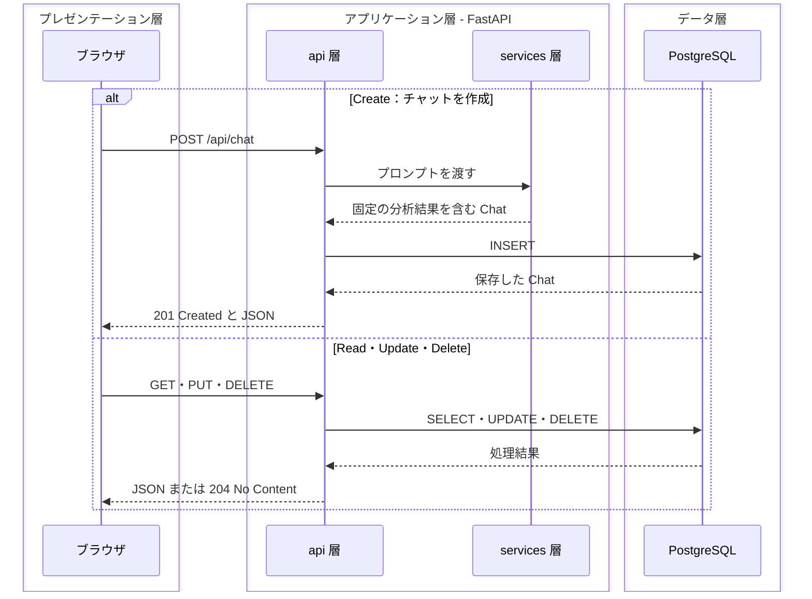
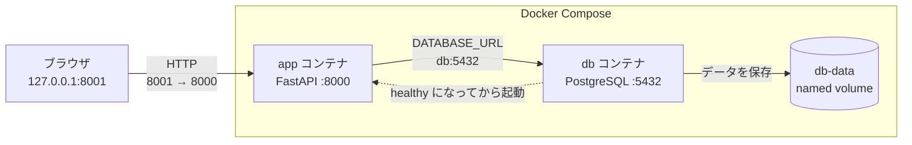
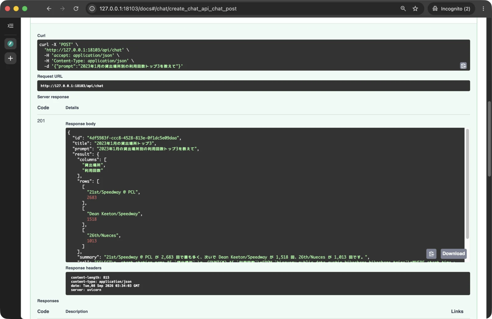
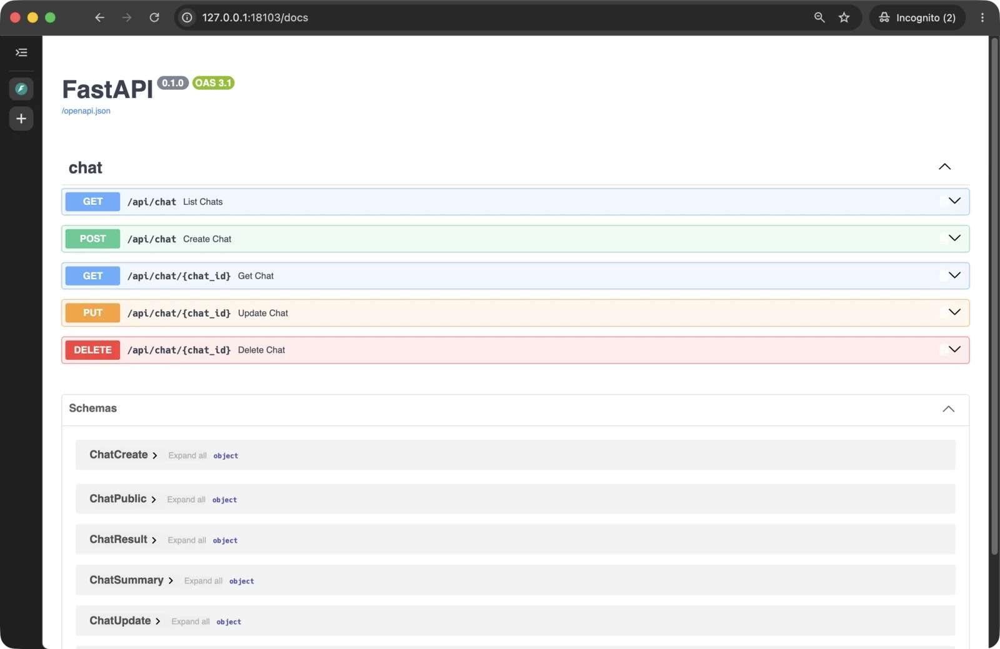
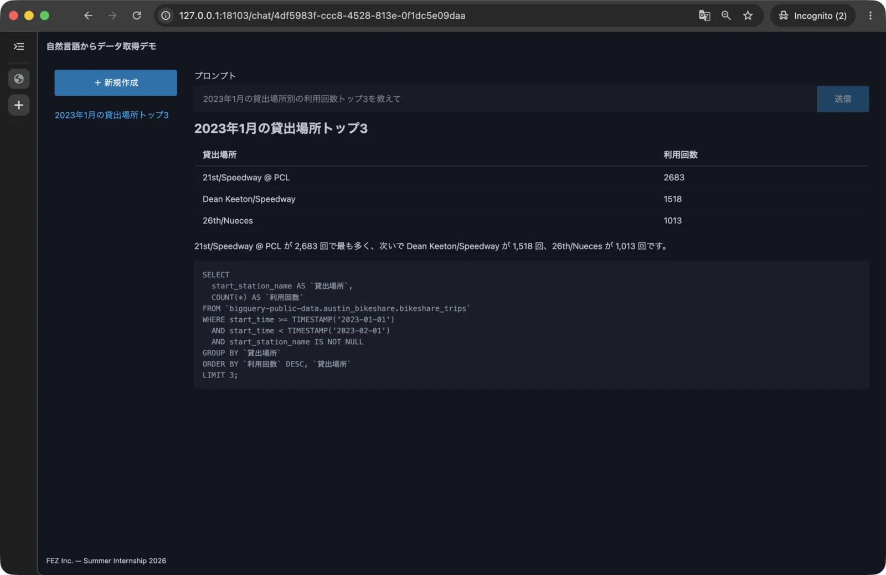

# 第 3 章: PostgreSQL にチャット履歴を保存する

この章では、第 1 章で作ったモック API を、PostgreSQL にチャット履歴を保存する API へ置き換えます。
第 2 章で作った Docker Compose の開発環境に PostgreSQL を追加し、アプリやコンテナを再起動しても、作成したチャットを取得できる状態へ進みましょう。

- この章でやること
  - Docker Compose で PostgreSQL を起動し、データを永続化する
  - SQLModel でテーブルとデータベースへの接続処理を作る
  - 分析結果を作るモック処理を API から分離する
  - チャットの作成・取得・更新・削除を PostgreSQL に対して行う
  - Swagger UI で CRUD 処理を一巡し、ブラウザで作成と取得を確認する
  - コンテナを再起動してもデータが残ることを確認する
- この章ではやらないこと
  - BigQuery からの分析データの取得
  - データベースのマイグレーション管理

章の最後には、ブラウザから作成したチャット履歴が PostgreSQL に保存され、アプリを再起動しても一覧や詳細を取得できる状態になります。

## 3.1 チャット履歴を保存する流れを確認する

第 1 章で作った API は、プログラム内に書いた固定値を返しています。そのため実際にはデータベースを保存したり読み込んだりという操作は行われていません。
実際の多くのアプリケーションではデータベースに対してデータの読み書き・更新・削除をおこないます。この様な操作を一般的に CRUD (Create, Read, Update, Delete) 処理といいます。この章ではこの CRUD 処理を実装していきましょう。

今回はデータベースとして [PostgreSQL](https://www.postgresql.org/) を使います。PostgreSQL は、データを表形式で管理するリレーショナルデータベースです。

テーブルとしてはチャットを管理する 1 つのみを作成します。テーブルの 1 行が 1 件のチャット、列がタイトルやプロンプトなどの項目に対応します。各行は、重複しない `id` を主キーとして識別します。

API の操作と CRUD は次のように対応します。

| 操作 | CRUD | API |
|---|---|---|
| チャットを作る | Create | `POST /api/chat` |
| 一覧や詳細を読む | Read | `GET /api/chat`、`GET /api/chat/{chat_id}` |
| タイトルを変える | Update | `PUT /api/chat/{chat_id}` |
| チャットを消す | Delete | `DELETE /api/chat/{chat_id}` |

処理は、ブラウザ、FastAPI アプリケーション、PostgreSQL の 3 層に分かれます。FastAPI アプリケーションの中では、api 層が HTTP の入出力とデータベース操作を担当し、services 層がチャットの分析を担当します。



ブラウザからチャットを作成すると、FastAPI が PostgreSQL にデータを追加します。その後の一覧表示や詳細表示では、固定値ではなく PostgreSQL から取得したデータを返します。分析結果そのものは、この章でも固定値のままです。

## 3.2 Docker Compose で PostgreSQL を起動する

第 2 章の Docker Compose には、FastAPI を動かす `app` サービスだけが定義されています。ここへ PostgreSQL を動かす `db` サービスを追加し、2 つのコンテナをまとめて起動できるようにします。



Colima を起動し、`hands-on` ディレクトリへ移動します。

```bash
colima start
cd ~/Projects/fez-2026-summer-intern-public/hands-on
```

### 3.2.1 PostgreSQL のデータを永続化する

`docker-compose.yml` の `services` に、`app` と同じ深さで次の `db` サービスを追加します。

```yaml
  db:
    image: postgres:18
    environment:
      POSTGRES_USER: app
      POSTGRES_PASSWORD: app
      POSTGRES_DB: app
    volumes:
      - "db-data:/var/lib/postgresql"
    healthcheck:
      test: ["CMD-SHELL", "pg_isready -U app -d app -h 127.0.0.1"]
      interval: 5s
      timeout: 5s
      retries: 5
```

`POSTGRES_USER`、`POSTGRES_PASSWORD`、`POSTGRES_DB` は、開発用データベースのユーザー名、パスワード、データベース名です。今回はすべて `app` とします。

`volumes` では、PostgreSQL の保存先に `db-data` という named volume を割り当てます。コンテナを作り直しても volume は残るため、チャット履歴を引き続き利用できます。

`healthcheck` の `pg_isready` は、PostgreSQL が接続を受け付けられる状態かを確認します。この結果は、次の小節でアプリの起動順を制御するために使います。

ファイルの末尾に、使用する named volume を定義します。ここは `services` と同じ深さです。

```yaml
volumes:
  db-data:
```

### 3.2.2 PostgreSQL の起動を待ってアプリを起動する

`app` サービスの `volumes` の下へ、`environment` と `depends_on` を追加します。

```yaml
    environment:
      DATABASE_URL: postgresql+psycopg://app:app@db:5432/app
    depends_on:
      db:
        condition: service_healthy
```

`DATABASE_URL` は、アプリが PostgreSQL へ接続するための情報です。`@db` の `db` はホスト名で、Compose 内ではサービス名を使って別のコンテナへ接続できます。`5432` は PostgreSQL のポート番号です。

`depends_on` に `service_healthy` を指定すると、`db` の healthcheck が成功した後で `app` が起動します。これにより、PostgreSQL の準備が終わる前にアプリが接続しようとすることを防ぎます。

この時点の `docker-compose.yml` 全体は、次の構成になります。

```yaml
name: public-data-analysis-hands-on
services:
  app:
    image: public-data-analysis-hands-on-app
    build: .
    command:
      [
        "uv",
        "run",
        "--no-sync",
        "fastapi",
        "dev",
        "app/main.py",
        "--host",
        "0.0.0.0",
      ]
    ports: ["127.0.0.1:8001:8000"]
    volumes:
      - "./:/app"
      - "/app/.venv"
    environment:
      DATABASE_URL: postgresql+psycopg://app:app@db:5432/app
    depends_on:
      db:
        condition: service_healthy

  db:
    image: postgres:18
    environment:
      POSTGRES_USER: app
      POSTGRES_PASSWORD: app
      POSTGRES_DB: app
    volumes:
      - "db-data:/var/lib/postgresql"
    healthcheck:
      test: ["CMD-SHELL", "pg_isready -U app -d app -h 127.0.0.1"]
      interval: 5s
      timeout: 5s
      retries: 5

volumes:
  db-data:
```

### 3.2.3 PostgreSQL が起動したことを確認する

Compose が設定を読み込めることを確認します。

```bash
docker compose config
```

エラーがなく、`services` に `app` と `db` が表示されれば設定を読み込めています。続けてコンテナを起動します。初回は PostgreSQL のイメージをダウンロードするため、少し時間がかかります。

```bash
docker compose up
```

`db` のログに `database system is ready to accept connections`、その次に `Container public-data-analysis-hands-on-db-1 Healthy`、そして続けて `app` のログに `Application startup complete.` と表示されることを確認します。

コンテナは起動したままにし、VS Code でもう 1 つターミナルを開きます。新しいターミナルで次を実行します。

```bash
cd ~/Projects/fez-2026-summer-intern-public/hands-on
docker compose ps
```

`app` と `db` の 2 行が表示され、`db` の `STATUS` に `healthy` が含まれていれば PostgreSQL の準備は完了です。ただし、この時点でアプリはまだデータベースに接続されていないため、[http://127.0.0.1:8001/](http://127.0.0.1:8001/) では第 1 章の固定データが表示されます。

ここまでの変更をコミットします。

```bash
git add docker-compose.yml
git commit -m "feat: Docker Compose に PostgreSQL を追加"
```

## 3.3 アプリからチャットテーブルを作る

PostgreSQL は起動しましたが、アプリにはまだ接続処理もテーブルもありません。ここでは、接続に必要な部品を作り、FastAPI の起動時に `chat` テーブルが作られるようにします。

### 3.3.1 PostgreSQL へ接続するパッケージを追加する

アプリのコンテナを起動したまま、2 つ目のターミナルでパッケージを追加します。

```bash
docker compose exec app uv add "psycopg[binary]" pydantic-settings
```

追加したパッケージの役割は次のとおりです。

| パッケージ | 役割 |
|---|---|
| `psycopg` | Python から PostgreSQL へ接続する |
| `pydantic-settings` | 接続先などの設定を環境変数から読み取る |

第 1 章で API のスキーマを作るために追加した SQLModel は、テーブルの定義にも利用します。`pyproject.toml` と `uv.lock` が更新され、実行中のコンテナにも今回追加したパッケージがインストールされます。

ただし、インストール先は実行中のコンテナの `/app/.venv` であり、イメージには含まれません。第 3.5.5 節でコンテナを作り直すときに、イメージのビルドもやり直します。

### 3.3.2 接続先を環境変数から読み取る

`docker-compose.yml` に書いた `DATABASE_URL` を Python から利用できるようにします。`app/config.py` を作成し、次の内容を記述します。

```python
from pydantic_settings import BaseSettings


class Settings(BaseSettings):
    database_url: str


settings = Settings()
```

環境変数名は大文字の `DATABASE_URL`、Python の属性名は小文字の `database_url` ですが、`BaseSettings` が対応づけて読み取ります。設定がない場合は起動時にエラーになるため、接続先の指定漏れにも気づけます。

### 3.3.3 Engine と Session を作る

[SQLModel](https://sqlmodel.tiangolo.com/) では、Engine がデータベースとの接続を管理し、Session を通じてデータを読み書きします。

`app/db.py` を作成し、次の内容を記述します。

```python
from collections.abc import Generator

from sqlmodel import Session, SQLModel, create_engine

from app.config import settings

engine = create_engine(settings.database_url)


def get_session() -> Generator[Session, None, None]:
    with Session(engine) as session:
        yield session


def create_db_and_tables() -> None:
    SQLModel.metadata.create_all(engine)
```

`create_engine` は、先ほど読み取った接続先から Engine を作ります。`get_session` は処理ごとに Session を開き、処理が終わると閉じます。後ほど FastAPI の依存性注入を使い、各 API からこの Session を受け取ります。

`create_db_and_tables` は、SQLModel に登録されたテーブルのうち、まだ存在しないものを作る関数です。

> [!NOTE]
> この教材では、この様に `create_db_and_tables` として直接 DB へテーブル作成を行っています。この規模であればこれで十分ですが、実際のアプリケーションではテーブルの追加や、それに伴うデータの引越しなどが大変な作業になるため、このようなマイグレーションと呼ばれる概念を別途 [`Alembic`](https://alembic.sqlalchemy.org/en/latest/) などのライブラリを使って管理することが多いです。

### 3.3.4 チャットテーブルを定義する

第 1 章で作った `app/schemas/chat.py` は、API が受け渡すデータの形を定義しています。ここではスキーマを変更せず、PostgreSQL に保存するテーブルを表すクラスを `app/models` に作ります。

ディレクトリとファイルを作成します。

```bash
mkdir -p app/models
touch app/models/__init__.py app/models/chat.py
```

`app/models/chat.py` に、チャットを保存する `Chat` クラスを記述します。

```python
from datetime import UTC, datetime
from uuid import UUID, uuid4

from sqlalchemy import DateTime
from sqlalchemy.dialects.postgresql import JSONB
from sqlmodel import Field, SQLModel


def utcnow() -> datetime:
    return datetime.now(UTC)


class Chat(SQLModel, table=True):
    id: UUID = Field(default_factory=uuid4, primary_key=True)
    title: str
    prompt: str
    sql: str
    result_table: dict = Field(sa_type=JSONB)
    summary: str
    created_at: datetime = Field(
        default_factory=utcnow,
        sa_type=DateTime(timezone=True),
        nullable=False,
    )
    updated_at: datetime = Field(
        default_factory=utcnow,
        sa_type=DateTime(timezone=True),
        nullable=False,
        sa_column_kwargs={"onupdate": utcnow},
    )
```

API のスキーマと異なり、`table=True` を付けた `Chat` はデータベースのテーブルを表します。

- `id` はチャットを識別する主キーで、新しい UUID を自動生成する
- `result_table` は列数や行数が結果ごとに変わるため、JSON を保存できる `JSONB` 型にする
- `created_at` と `updated_at` は、作成・更新した日時を UTC で保存する

`app/models/__init__.py` から `Chat` を読み込めるようにします。

```python
from app.models.chat import Chat as Chat
```

### 3.3.5 アプリの起動時にテーブルを作る

FastAPI の起動時に `create_db_and_tables` を呼び出します。`app/main.py` を次の内容に置き換えます。

```python
from contextlib import asynccontextmanager

from fastapi import FastAPI

from app import models  # noqa: F401
from app.api import chat
from app.db import create_db_and_tables


@asynccontextmanager
async def lifespan(app: FastAPI):
    create_db_and_tables()
    yield


app = FastAPI(lifespan=lifespan)

app.include_router(chat.router)
app.frontend("/", directory="public", fallback="index.html")
```

`lifespan` は、FastAPI の起動から終了までに行う処理を定義します。`yield` より前にテーブルを作るため、API がリクエストを受け付ける時点では `chat` テーブルを利用できます。

`from app import models` は、`Chat` のテーブル定義を SQLModel へ登録するために必要です。Python のコードから直接名前を参照していないですが、不要ではないことを示すために `# noqa: F401` を付けています。

### 3.3.6 PostgreSQL でテーブルを確認する

ファイルを保存すると FastAPI が再起動し、テーブルが作られます。起動ログにエラーがないことを確認してから、2 つ目のターミナルで次を実行します。

```bash
docker compose exec db psql -U app -d app -c '\d chat'
```

`chat` テーブルの情報が表示され、次の列を確認できれば成功です。

```text
id
title
prompt
sql
result_table
summary
created_at
updated_at
```

`id` には主キーを示す `PRIMARY KEY`、`result_table` の型には `jsonb` が表示されます。この時点では、テーブルの中身はまだ空です。

[http://127.0.0.1:8001/](http://127.0.0.1:8001/) を再読み込みし、これまでどおり固定データが表示されることも確認します。接続処理とテーブルを追加しただけなので、API の動作はまだ変わっていません。

ここまでの変更をコミットします。

```bash
git add pyproject.toml uv.lock app
git commit -m "feat: DB 接続基盤と chat のモデルを SQLModel で追加"
```

## 3.4 チャット API をデータベースの CRUD 処理へ置き換える

ここからは、固定データを返している `app/api/chat.py` を PostgreSQL に対する処理へ置き換えます。

API は HTTP の入出力、models 層はデータベースへの保存形式、これから作成する services 層はチャットの分析、を担当します。役割を分けておくと、後続の章では API や保存処理を変えずに、分析の固定値だけを BigQuery や LLM へ置き換えられます。

### 3.4.1 分析のモック処理を services 層へ分ける

これまで `app/api/chat.py` に書いていた固定の分析結果を services 層へ移します。ディレクトリとファイルを作成します。

```bash
mkdir -p app/services
touch app/services/__init__.py app/services/analysis.py
```

`app/services/analysis.py` に次の内容を記述します。

```python
from app.models import Chat


def _generate_title(prompt: str) -> str:
    return "2023年1月の貸出場所トップ3"


def _generate_sql(prompt: str) -> str:
    return (
        'SELECT\n'
        '  start_station_name AS `貸出場所`,\n'
        '  COUNT(*) AS `利用回数`\n'
        'FROM `bigquery-public-data.austin_bikeshare.bikeshare_trips`\n'
        "WHERE start_time >= TIMESTAMP('2023-01-01')\n"
        "  AND start_time < TIMESTAMP('2023-02-01')\n"
        '  AND start_station_name IS NOT NULL\n'
        'GROUP BY `貸出場所`\n'
        'ORDER BY `利用回数` DESC, `貸出場所`\n'
        'LIMIT 3;\n'
    )


def _get_table(sql: str) -> dict:
    return {
        "columns": ["貸出場所", "利用回数"],
        "rows": [["21st/Speedway @ PCL", 2683], ["Dean Keeton/Speedway", 1518], ["26th/Nueces", 1013]],
    }


def _generate_summary(prompt: str, table: dict) -> str:
    return "21st/Speedway @ PCL が 2,683 回で最も多く、次いで Dean Keeton/Speedway が 1,518 回、26th/Nueces が 1,013 回です。"


def create_chat(prompt: str) -> Chat:
    title = _generate_title(prompt)
    sql = _generate_sql(prompt)
    table = _get_table(sql)
    summary = _generate_summary(prompt, table)

    return Chat(
        title=title,
        prompt=prompt,
        sql=sql,
        result_table=table,
        summary=summary,
    )
```

`create_chat` はプロンプトを受け取り、データベースへ保存できる `Chat` を組み立てます。4 つの内部関数はまだ固定値を返しますが、分析の「タイトルを作る→SQL を作る→表を取得する→要約する」という流れを表しています。

> [!TIP]
> 関数の名前にアンダースコア (`_`) で始まるものがあるのに気づいたでしょうか？これはこのモジュール内のみで使われる内部関数を示しています。必ずしもこの命名規則に従う必要はありませんが、関数が増えてきたときにも外部から使われる関数との区別がついてわかりやすいなどのメリットがあります。
>
> この命名規則は PEP 8 でも記載されています。仕様として、`from module import *` の様に書いたときにアンダースコア (`_`) で始まる関数はインポートされないようになっています。以下のコードを実行して実際に試してみるとどうなるかみてみましょう。
>
> `docker compose exec app uv run python -c "from app.services.analysis import *; print(sorted(dir()))"`
>
> 参考: [PEP 8 - Style Guide for Python Code](https://peps.python.org/pep-0008/#:~:text=_single_leading_underscore%3A%20weak%20%E2%80%9Cinternal%20use%E2%80%9D%20indicator.%20E.g.%20from%20M%20import%20*%20does%20not%20import%20objects%20whose%20names%20start%20with%20an%20underscore.)

### 3.4.2 データベースのデータを API のレスポンスへ変換する

データベースでは `sql`、`result_table`、`summary` を別々に保存します。一方、API ではこれらを `result` の中へまとめて返すため、変換処理が必要です。

`app/api/chat.py` を、まず次の内容へ置き換えます。この時点では変換処理までを作り、エンドポイントは次の小節から一つずつ追加します。

```python
from uuid import UUID

from fastapi import APIRouter, Depends, HTTPException
from sqlmodel import Session, select

from app.db import get_session
from app.models import Chat
from app.schemas.chat import (
    ChatCreate,
    ChatPublic,
    ChatResult,
    ChatSummary,
    ChatUpdate,
)
from app.services import analysis as service

router = APIRouter(prefix="/api/chat", tags=["chat"])


def _to_public(chat: Chat) -> ChatPublic:
    result = ChatResult(
        columns=chat.result_table["columns"],
        rows=chat.result_table["rows"],
        summary=chat.summary,
        sql=chat.sql,
    )
    return ChatPublic(
        id=chat.id,
        title=chat.title,
        prompt=chat.prompt,
        result=result,
    )


def _to_summary(chat: Chat) -> ChatSummary:
    return ChatSummary(id=chat.id, title=chat.title, prompt=chat.prompt)
```

`_to_public` は詳細表示用、`_to_summary` は一覧表示用のデータへ変換します。一覧には表や SQL を含めず、サイドバーに必要な項目だけを返します。

### 3.4.3 Create: チャットを作成する

`app/api/chat.py` の末尾に、チャットを作成するエンドポイントを追加します。

```python
@router.post("", status_code=201)
def create_chat(
    payload: ChatCreate,
    session: Session = Depends(get_session),
) -> ChatPublic:
    chat = service.create_chat(payload.prompt)

    session.add(chat)
    session.commit()
    session.refresh(chat)

    return _to_public(chat)
```

`Depends(get_session)` により、このリクエストで使う Session を受け取ります。作成処理は次の順に進みます。

1. services 層で `Chat` を組み立てる
2. `session.add` で追加するデータとして登録する
3. `session.commit` で PostgreSQL へ保存する
4. `session.refresh` で自動生成された `id` などを読み直す
5. API のレスポンスへ変換して返す

[http://127.0.0.1:8001/docs](http://127.0.0.1:8001/docs) を開き、`POST /api/chat` の「Try it out」を押します。リクエストボディに次を入力して「Execute」を押します。

```json
{
  "prompt": "2023年1月の貸出場所別の利用回数トップ3を教えて"
}
```



ステータスコードが `201` になり、レスポンスに UUID 形式の `id` と固定の分析結果が含まれれば、チャットを作成できています。後の確認で使うため、`id` を控えておきます。

### 3.4.4 Read: チャットの一覧と詳細を取得する

`app/api/chat.py` の末尾に、一覧と詳細を取得する 2 つのエンドポイントを追加します。

```python
@router.get("")
def list_chats(session: Session = Depends(get_session)) -> list[ChatSummary]:
    chats = session.exec(select(Chat).order_by(Chat.created_at.desc()))
    return [_to_summary(chat) for chat in chats]


@router.get("/{chat_id}")
def get_chat(
    chat_id: UUID,
    session: Session = Depends(get_session),
) -> ChatPublic:
    chat = session.get(Chat, chat_id)
    if chat is None:
        raise HTTPException(status_code=404, detail="Chat not found")
    return _to_public(chat)
```

一覧では `select(Chat)` で全件を取得し、`created_at.desc()` で新しい順に並べます。詳細では主キーの UUID を使って 1 件を取得し、存在しない場合は `404 Not Found` を返します。

Swagger UI で `GET /api/chat` を実行し、先ほど作成したチャットが一覧に含まれることを確認します。続けて `GET /api/chat/{chat_id}` に控えておいた `id` を入力し、表、要約、SQL を含むデータが返ることを確認します。

### 3.4.5 Update: チャットのタイトルを更新する

`app/api/chat.py` の末尾に、タイトルを更新するエンドポイントを追加します。

```python
@router.put("/{chat_id}")
def update_chat(
    chat_id: UUID,
    payload: ChatUpdate,
    session: Session = Depends(get_session),
) -> ChatPublic:
    chat = session.get(Chat, chat_id)
    if chat is None:
        raise HTTPException(status_code=404, detail="Chat not found")

    chat.title = payload.title
    session.commit()
    session.refresh(chat)
    return _to_public(chat)
```

作成時と同様に、変更後は `commit` で保存し、`refresh` でデータを読み直します。

Swagger UI で `PUT /api/chat/{chat_id}` に控えておいた `id` を入力し、次のリクエストボディを送信します。

```json
{
  "title": "1月の貸出場所ランキング"
}
```

ステータスコードが `200` になり、レスポンスの `title` が更新されれば成功です。

### 3.4.6 Delete: チャットを削除する

削除に成功したときはレスポンスボディを返さず、`204 No Content` だけを返すようにします。`app/api/chat.py` の末尾に、削除するエンドポイントを追加します。

```python
@router.delete("/{chat_id}", status_code=204)
def delete_chat(
    chat_id: UUID,
    session: Session = Depends(get_session),
) -> None:
    chat = session.get(Chat, chat_id)
    if chat is None:
        return

    session.delete(chat)
    session.commit()
```

すでに削除された `id` を指定しても、削除済みという同じ状態になるため `204` を返します。

Swagger UI で `DELETE /api/chat/{chat_id}` に控えておいた `id` を入力し、ステータスコードが `204` になることを確認します。その後 `GET /api/chat/{chat_id}` を実行し、`404` が返ればデータも削除されています。

ここまでの変更をコミットします。

```bash
git add app/api app/services
git commit -m "feat: chat API を DB による CRUD に置き換え"
```

> [!NOTE]
> なぜ、`DELETE` のときだけ `chat_id` が無効なものになっていても `404 Not Found` ではなく `204 No Content` なのか疑問に思ったかもしれません。これは同じリクエストを送ったときに同じ結果が返ってくるという冪等性 (べきとうせい) を保つためです。もちろん `404` とすること自体は間違いではありませんが、今回は冪等性を重視し、削除を受け付けた場合もすでに削除されていた場合も同一のレスポンスコードになるように設計しています。

## 3.5 保存したチャットを確認する

実装した API を一巡し、API の外側からも PostgreSQL に保存できていることを確認します。

### 3.5.1 Swagger UI で CRUD 処理を一巡する

[http://127.0.0.1:8001/docs](http://127.0.0.1:8001/docs) で、次の順に API を実行します。



1. `POST /api/chat` でチャットを作成し、返された `id` を控える
2. `GET /api/chat` で作成したチャットが一覧の先頭にあることを確認する
3. `GET /api/chat/{chat_id}` で表、要約、SQL を取得する
4. `PUT /api/chat/{chat_id}` でタイトルを変更する
5. `DELETE /api/chat/{chat_id}` で削除する
6. `GET /api/chat/{chat_id}` が `404` になることを確認する

最後に `POST /api/chat` をもう一度実行し、次の確認で使うチャットを 1 件残しておきます。

### 3.5.2 エラーとステータスコードを確認する

API が処理結果に合ったステータスコードを返すことを確認します。

| 確認内容 | 期待するコード |
|---|---:|
| `POST` で作成する | `201 Created` |
| 存在しない UUID を `GET` する | `404 Not Found` |
| UUID ではない文字列を `GET` する | `422 Unprocessable Content` |
| `DELETE` する | `204 No Content` |

存在しない UUID の例には、`00000000-0000-0000-0000-000000000000` など適当なものを入力してみてください。不正な文字列の例には `invalid-id` など適当な文字列を使ってください。

直前に `POST` で作成したチャットの UUID を指定して `DELETE /api/chat/{chat_id}` を 2 回実行します。どちらも `204` になることを確認したら、ブラウザで確認するチャットを `POST` でもう一度作成して残しておきます。

### 3.5.3 ブラウザからチャットを作成して開く

[http://127.0.0.1:8001/](http://127.0.0.1:8001/) を開き、次の操作を行います。



1. サイドバーに、Swagger UI で残したチャットが表示される
2. 「＋ 新規作成」を押し、任意のプロンプトを送信する
3. URL が `/chat/{id}` に変わり、固定の分析結果が表示される
4. ページを再読み込みすると、作成したチャットがサイドバーに表示される
5. サイドバーからチャットを選ぶと、保存した結果を再表示できる

画面側のコードは変更していません。API の保存先を置き換えたことで、同じ画面から PostgreSQL のデータを利用できるようになりました。

### 3.5.4 PostgreSQL に保存されたデータを確認する

画面に表示されたデータが PostgreSQL にあることを、`psql` で直接確認します。

```bash
docker compose exec db psql -U app -d app -c \
  "SELECT id, title, prompt FROM chat ORDER BY created_at DESC;"
```

ブラウザと Swagger UI で作成したチャットの `id`、`title`、`prompt` が表示されれば、API を通じて PostgreSQL に保存されています。

### 3.5.5 コンテナを再起動してもデータが残ることを確認する

Compose の起動ログを表示しているターミナルで `Control + C` を押します。続けて、コンテナと匿名ボリュームを削除してから作り直します。

```bash
docker compose rm -fsv
docker compose up --build
```

`docker compose rm` はコンテナを削除するコマンドで、`-s` はコンテナを停止してから削除すること、`-f` は確認の省略、`-v` はコンテナに紐づく匿名ボリュームの削除を指定します。ここで削除されるのは第 2.3.3 節で確認した `/app/.venv` の匿名ボリュームだけで、named volume の `db-data` は残ります。

`--build` はイメージを作り直します。第 3.3.1 節の `uv add` は実行中のコンテナの `/app/.venv` にパッケージを入れただけなので、イメージにも反映しておく必要があります。

> [!NOTE]
> コンテナを作り直すときは、一般的に `docker compose down` を使うことが多いです。今回 `docker compose rm -fsv` を使うのは、`app` サービスが `/app/.venv` を匿名ボリュームとして持っているためです。
>
> `docker compose down` はコンテナとネットワークを削除しますが、匿名ボリュームは削除しません。そのため `down` と `up` を繰り返すと 2 つの問題が起きます。
>
> - `up` のたびに匿名ボリュームがイメージの内容で作り直され、`uv add` で入れた `psycopg` が消えて `No module named 'psycopg'` でアプリが起動しなくなる
> - 使われなくなった匿名ボリュームが、繰り返すたびに 1 つずつ残り続けることです。
>
> 匿名ボリュームも削除する `docker compose down -v` は、`db-data` まで削除してチャット履歴が消えてしまうため使えません。`docker compose rm -fsv` なら削除対象が匿名ボリュームだけなので、履歴を残したままコンテナを作り直せます。
>
> `rm` は `down` と違いネットワークを削除しませんが、ネットワークは次の `up` で再利用され増えていかないため、章の最後の `down` でまとめて削除します。
>
> すでに溜まってしまった匿名ボリュームは `docker volume ls -f dangling=true` で確認し、`docker volume prune` で削除できます。`-a` を付けない限り、`db-data` のような named volume は削除されません。

起動後にブラウザを再読み込みし、先ほど作成したチャットがサイドバーに残っていることを確認します。これで、チャット履歴がコンテナではなく named volume に保存されていることを確認できました。

## 3.6 全体を確認して変更をコミットする

最後に、更新した依存パッケージを含むイメージを作り直し、最初から起動できることを確認します。起動中のターミナルで `Control + C` を押してから実行してください。

```bash
docker compose rm -fsv
docker compose up --build
```

`Application startup complete.` と表示されたら、次を確認します。

1. [http://127.0.0.1:8001/](http://127.0.0.1:8001/) に保存済みのチャットが表示される
2. 新しいチャットを作成し、ページの再読み込み後も取得できる
3. [http://127.0.0.1:8001/docs](http://127.0.0.1:8001/docs) に 5 つの CRUD API が表示される
4. `docker compose ps` で `app` と `db` が起動し、`db` が `healthy` になっている

確認できたら `Control + C` を押し、コンテナと Colima を停止します。匿名ボリュームを残さないように `rm -fsv` を実行してから、ネットワークまで削除する `down` を実行します。

```bash
docker compose rm -fsv
docker compose down
colima stop
```

リポジトリのルートで、変更したファイルとコミットを確認します。

```bash
cd ~/Projects/fez-2026-summer-intern-public
git status
git log --oneline -3
```

`git status` に `nothing to commit, working tree clean` と表示され、最新の 3 件が次のコミットになっていることを確認します。

```text
feat: chat API を DB による CRUD に置き換え
feat: DB 接続基盤と chat のモデルを SQLModel で追加
feat: Docker Compose に PostgreSQL を追加
```

変更がコミットされ、動作確認ができればこの章は完了です。作成したチャット履歴は PostgreSQL に保存され、アプリを再起動しても利用できます。
