# 第 7 章: フロントエンドのブラッシュアップ

この章では、第 6 章までに作成した API をフロントエンドから利用し、チャットの操作中や API の応答後も画面の状態が分かるように調整します。

- この章でやること
  - API を利用して、チャットのタイトルを更新し、不要なチャットを削除できるようにする
  - チャットの送信中に待機状態を表示し、フォームの二重送信や画面遷移を防ぐ
  - チャットの作成結果を画面へ直接描画し、URL とサイドバーの履歴を更新する
  - SQL の生成拒否と予期しない API エラーを、ユーザーが確認できる形で表示する
- この章ではやらないこと
  - バックエンドの API、データベース、LLM による SQL 生成処理の変更
  - フロントエンドフレームワークの導入や画面デザイン全体の変更

章の最後には、タイトルの更新とチャットの削除ができ、チャットの送信中・作成成功・作成失敗のそれぞれで適切な画面状態を表示できるようになります。

## 7.1 タイトルの更新とチャットの削除を画面から操作する

第 3 章で、チャットのタイトルを更新する `PUT /api/chat/{chat_id}` と、チャットを削除する `DELETE /api/chat/{chat_id}` を作成しました。しかし、現在のフロントエンドにはこれらの API を呼び出す操作がなく、タイトルの更新とチャットの削除には Swagger UI を使う必要があります。

この節では、チャットの詳細画面へ操作ボタンと確認用のモーダルを追加し、タイトルの更新とチャットの削除をブラウザから行えるようにします。


*図 7-1: 操作ボタンを追加する前のチャット詳細画面*

### 7.1.1 更新・削除の画面と API の流れを確認する

タイトルの更新とチャットの削除では、誤操作を防ぐため、ボタンを押した直後には API を呼び出しません。モーダルで変更内容や削除の意思を確認してから API を呼び出し、成功後に現在の画面とサイドバーを更新します。

| 操作 | API | API 成功後の画面 |
|---|---|---|
| タイトルを更新する | `PUT /api/chat/{chat_id}` | 見出しとサイドバーのタイトルを更新する |
| チャットを削除する | `DELETE /api/chat/{chat_id}` | サイドバーを更新し、新規作成画面へ戻る |

タイトル更新 API は、リクエストボディの `title` を保存し、更新後のチャットを JSON で返します。削除 API は、削除後の本文を持たない `204 No Content` を返すため、フロントエンドではレスポンスを JSON に変換しません。

第 6 章の最後に停止した Colima を起動し、作業対象のディレクトリへ移動します。

```bash
colima start
cd ~/Projects/fez-2026-summer-intern-public/hands-on
docker compose up
```

`Application startup complete.` と表示されたら、コンテナは起動したままにします。VS Code でもう 1 つターミナルを開き、新しいターミナルで同じディレクトリへ移動してください。

```bash
cd ~/Projects/fez-2026-summer-intern-public/hands-on
```

### 7.1.2 操作ボタンとモーダルを追加する

最初に、チャットの詳細画面で利用する 2 つのモーダルを用意します。`public/index.html` のフッターの後ろ、`</body>` の直前へ次の内容を追加します。

```html
<!-- タイトル変更用のモーダル -->
<dialog id="title-dialog">
  <article>
    <header>
      <button
        type="button"
        rel="prev"
        aria-label="Close"
        data-close
      ></button>
      <p><strong>タイトルを編集</strong></p>
    </header>
    <input type="text" id="title-input" name="title" />
    <footer>
      <button type="button" class="secondary" data-close>
        キャンセル
      </button>
      <button type="button" id="title-save">保存</button>
    </footer>
  </article>
</dialog>

<!-- チャット削除用のモーダル -->
<dialog id="delete-dialog">
  <article>
    <header>
      <button
        type="button"
        rel="prev"
        aria-label="Close"
        data-close
      ></button>
      <p><strong>チャットの削除</strong></p>
    </header>
    <p>このチャットを削除しますか？</p>
    <footer>
      <button type="button" class="secondary" data-close>
        キャンセル
      </button>
      <button type="button" id="delete-submit">削除する</button>
    </footer>
  </article>
</dialog>
```

HTML の `dialog` 要素は、ページの手前に表示するモーダルを表します。タイトル変更用には入力欄と保存ボタン、削除用には確認文と削除ボタンを置いています。`data-close` は HTML 標準の属性ではなく、閉じる操作を行うボタンを JavaScript からまとめて識別するための属性です。

続けて、`public/app.js` で次の行を検索します。

```javascript
const promptSubmit = document.getElementById("prompt-submit");
```

この行の直後へ、モーダル内の要素を追加します。検索対象と追加内容を合わせると、次の並びになります。

```javascript
const promptSubmit = document.getElementById("prompt-submit");
const titleDialog = document.getElementById("title-dialog");
const titleInput = document.getElementById("title-input");
const titleSave = document.getElementById("title-save");
const deleteDialog = document.getElementById("delete-dialog");
const deleteSubmit = document.getElementById("delete-submit");
```

`public/app.js` で `async function loadList()` を検索します。`loadList` の閉じかっこの直後、`function render(chat)` の直前へ、操作ボタンを組み立てる `createActions` を追加します。

```javascript
function createActions(chat) {
  const edit = document.createElement("button");
  edit.type = "button";
  edit.className = "outline";
  edit.textContent = "タイトルを編集";

  const remove = document.createElement("button");
  remove.type = "button";
  remove.className = "outline secondary";
  remove.textContent = "このチャットを削除";

  const actions = document.createElement("div");
  actions.setAttribute("role", "group");
  actions.append(edit, remove);

  edit.onclick = () => {
    titleInput.value = chat.title;
    titleInput.removeAttribute("aria-invalid");
    titleDialog.showModal();
  };

  remove.onclick = () => {
    deleteDialog.showModal();
  };

  return actions;
}
```

Pico CSS は、`role="group"` を持つ要素内のボタンを 1 つのグループとして横並びにします。編集ボタンを押したときは、現在のタイトルを入力欄へ入れてから `showModal` でモーダルを開きます。この時点では API を呼び出さず、削除ボタンも確認用のモーダルを開くだけです。

`function render(chat)` を検索し、その中にある次の行を置き換えて、SQL の後ろへ操作ボタンを追加します。

```javascript
result.append(heading, table, description, pre);
```

```javascript
result.append(
  heading,
  table,
  description,
  pre,
  createActions(chat),
);
```

`public/app.js` で次の行を検索します。

```javascript
window.addEventListener("popstate", route);
```

この行の直前へ、`data-close` を持つボタンでモーダルを閉じる処理を追加します。

```javascript
document.querySelectorAll("dialog [data-close]").forEach((button) => {
  button.onclick = () => button.closest("dialog").close();
});
```

`button.closest("dialog")` は、押されたボタンを内包する最も近い `dialog` を取得します。タイトル変更用と削除用で同じ処理を利用できるため、モーダルごとに閉じる処理を書く必要はありません。

ファイルを保存してチャット履歴を開きます。分析結果の下に 2 つのボタンが表示され、それぞれのモーダルを開けることを確認してください。右上の閉じるボタンとキャンセルボタンでは、API を呼び出さずにモーダルを閉じられます。


*図 7-2: 操作ボタンとモーダルを追加したあとの動作*

### 7.1.3 タイトルを更新して画面と履歴へ反映する

編集モーダルの保存ボタンから、タイトル更新 API を呼び出します。タイトルを保存した後は、詳細画面の見出しだけでなく、サイドバーの履歴にも同じタイトルを反映します。

`public/app.js` で `function createActions(chat)` を検索し、関数宣言を次のように変更して、`render` が作成したタイトルの見出しを受け取れるようにします。

```javascript
function createActions(chat, heading) {
```

同じ `createActions` の中で `edit.onclick = () => {` を検索します。この行から、`remove.onclick = () => {` の直前にある `};` までを次の内容へ置き換えます。

```javascript
edit.onclick = () => {
  titleInput.value = chat.title;
  titleInput.removeAttribute("aria-invalid");

  titleSave.onclick = async () => {
    const title = titleInput.value.trim();

    if (!title) {
      titleInput.setAttribute("aria-invalid", "true");
      return;
    }

    try {
      titleSave.setAttribute("aria-busy", "true");

      const response = await fetch(`${API}/${chat.id}`, {
        method: "PUT",
        headers: { "Content-Type": "application/json" },
        body: JSON.stringify({ title }),
      });

      if (!response.ok) {
        throw new Error(`タイトルの更新に失敗しました: ${response.status}`);
      }

      chat.title = title;
      heading.textContent = title;
      await loadList();
      highlightActive();
      titleDialog.close();
    } finally {
      titleSave.removeAttribute("aria-busy");
    }
  };

  titleDialog.showModal();
};
```

入力値は `trim` で前後の空白を取り除き、空になった場合は API を呼び出さず `aria-invalid` を設定します。Pico CSS により入力欄がエラー状態で表示されるため、タイトルを入力してから保存する必要があることが分かります。

有効なタイトルでは、`PUT /api/chat/{chat_id}` へ JSON を送信します。`aria-busy="true"` を付けた保存ボタンには処理中のスピナーが表示され、`finally` で成功・失敗にかかわらず取り除かれます。

API が成功した後は、次の 3 か所を更新します。

1. 表示中の `chat.title`
2. 詳細画面の `heading.textContent`
3. `loadList` で再取得するサイドバーの履歴

`loadList` はサイドバーの要素を作り直すため、その後に `highlightActive` を呼び、表示中のチャットをもう一度選択状態にしています。

`function render(chat)` の中で、前項に追加した `createActions(chat)` を検索し、`createActions` へ見出しも渡すように変更します。

```javascript
result.append(
  heading,
  table,
  description,
  pre,
  createActions(chat, heading),
);
```

ファイルを保存し、チャットのタイトルを変更します。詳細画面の見出しとサイドバーのタイトルが、どちらも入力した内容へ更新されることを確認してください。


*図 7-3: タイトルを編集し、詳細画面とサイドバーへ反映する動作*

### 7.1.4 チャットを削除して新規作成画面へ戻る

削除モーダルの「削除する」ボタンから、削除 API を呼び出します。削除したチャットの詳細 URL に留まると、再読み込み時に存在しないチャットを取得することになるため、成功後は URL と画面を新規作成状態へ戻します。

`function createActions(chat, heading)` の中で `remove.onclick = () => {` を検索します。この行から、`return actions;` の直前にある `};` までを次の内容へ置き換えます。

```javascript
remove.onclick = () => {
  deleteSubmit.onclick = async () => {
    try {
      deleteSubmit.setAttribute("aria-busy", "true");

      const response = await fetch(`${API}/${chat.id}`, {
        method: "DELETE",
      });

      if (!response.ok) {
        throw new Error(`チャットの削除に失敗しました: ${response.status}`);
      }

      deleteDialog.close();
      history.replaceState({}, "", "/");
      await loadList();
      await route();
    } finally {
      deleteSubmit.removeAttribute("aria-busy");
    }
  };

  deleteDialog.showModal();
};
```

削除 API は `204 No Content` を返すため、`response.json()` は呼び出しません。レスポンスの `ok` だけを確認し、成功したら次の順に画面を更新します。

1. 削除確認モーダルを閉じる
2. `history.replaceState` で現在の詳細 URL を `/` へ置き換える
3. `loadList` でサイドバーから削除したチャットを取り除く
4. `route` で入力欄と分析結果を新規作成状態へ戻す

タイトル更新と削除の通信に失敗した場合は、現在のコードでは開発者ツールにエラーが出ます。ユーザー向けの共通メッセージと、エラー後に再操作できる状態へ戻す処理は、第 7.4 節で追加します。

ファイルを保存し、表示中のチャットを削除します。URL が `/` へ変わって新規作成画面へ戻り、削除したチャットがサイドバーから消えることを確認してください。

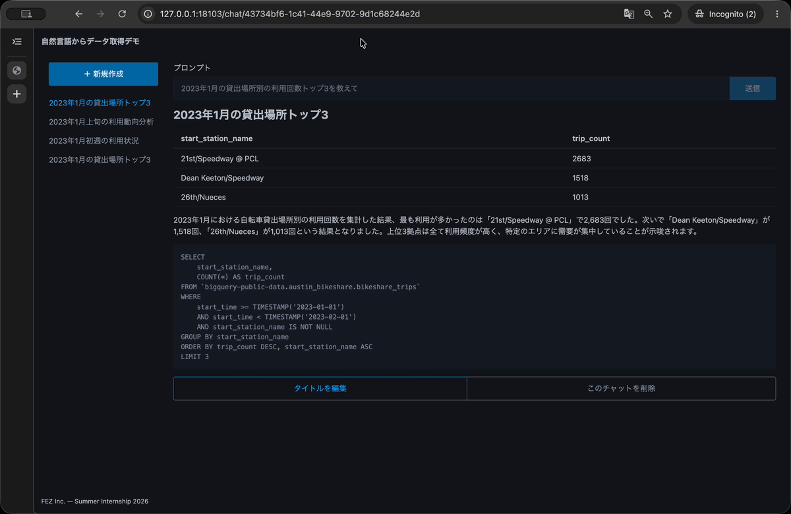

*図 7-4: チャットを削除し、新規作成画面へ戻る動作*

### 7.1.5 ブラウザでタイトルの更新とチャットの削除を確認する

ファイルを保存し、[http://127.0.0.1:8001/](http://127.0.0.1:8001/) を再読み込みします。履歴にチャットがない場合は、分析できる質問を送信して 1 件作成してから確認してください。

最初に、タイトルの更新を確認します。

1. サイドバーからチャットを開く
2. 「タイトルを編集」を押すと、現在のタイトルが入力されたモーダルが開く
3. タイトルを空にして「保存」を押すと、入力欄がエラー表示になり、モーダルが開いたままになる
4. 新しいタイトルを入力して「保存」を押すと、詳細画面とサイドバーのタイトルが更新される
5. ページを再読み込みしても、更新後のタイトルが表示される

続けて、チャットの削除を確認します。

1. 「このチャットを削除」を押すと、確認用のモーダルが開く
2. 「キャンセル」を押すと、チャットを残したままモーダルが閉じる
3. もう一度モーダルを開いて「削除する」を押す
4. URL が `/` になり、入力欄と分析結果が新規作成状態へ戻る
5. 削除したチャットがサイドバーから消え、ページを再読み込みしても表示されない

タイトル更新と削除が確認できたら、コミットの前にこの節の差分を確認します。

```bash
git diff -- public/index.html public/app.js
```

この節の差分が、次の変更だけになっていることを確認してください。

- `public/index.html` にタイトル更新用と削除用の 2 つの `dialog` を追加した
- `public/app.js` でモーダル内の要素を取得した
- `createActions` で操作ボタンと PUT・DELETE の処理を追加した
- `render` から `createActions` を呼び出した
- `data-close` を持つボタンでモーダルを閉じる処理を追加した

差分に問題がなければコミットします。

```bash
git add public/index.html public/app.js
git commit -m "feat: フロントエンドでタイトル更新・チャット削除対応"
```

## 7.2 チャットの送信中に待機状態を表示する

現在のフォームは、質問を送信してから結果が表示されるまで画面に変化がありません。LLM による SQL の生成や BigQuery の実行には時間がかかるため、送信を受け付けたのか判断できず、同じ質問を何度も送信する可能性があります。

この節では、送信ボタンにスピナーを表示し、処理中はフォームとアプリ内の画面遷移を無効にします。

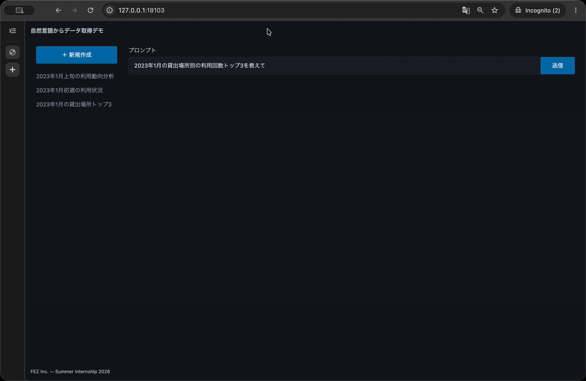

*図 7-5: 待機表示を追加する前のフォーム送信*

### 7.2.1 送信中に必要な画面状態を確認する

チャットの作成中は、次の画面状態をまとめて切り替えます。

| 対象 | 送信中の状態 | 目的 |
|---|---|---|
| 送信ボタン | スピナーを表示する | リクエストを処理していることを示す |
| 入力欄と送信ボタン | 無効にする | 入力の変更とフォームの二重送信を防ぐ |
| 新規作成ボタンと履歴 | 無効にする | 複数の非同期処理による画面の競合を防ぐ |

`fetch` の完了後は、成功・失敗のどちらでもスピナーと処理中の状態を解除します。作成成功時のフォームは、詳細画面を表示するため無効のままにします。作成失敗時に入力内容を残して再送信できるようにする処理は、第 7.4 節で追加します。

### 7.2.2 送信ボタンにスピナーを表示する

Pico CSS は、ボタンへ `aria-busy="true"` を設定するとスピナーを表示します。`public/app.js` で `form.addEventListener("submit", async (event) => {` を検索します。この行から、`loadList().then(route);` の直前にある対応する `});` まで、フォームの `submit` イベントリスナー全体を次の内容へ置き換えます。

```javascript
form.addEventListener("submit", async (event) => {
  event.preventDefault();

  try {
    promptSubmit.setAttribute("aria-busy", "true");
    setFormEnabled(false);

    const response = await fetch(API, {
      method: "POST",
      headers: { "Content-Type": "application/json" },
      body: JSON.stringify({ prompt: promptInput.value }),
    });
    const chat = await response.json();

    history.pushState({}, "", `/chat/${chat.id}`);
    await route();
  } finally {
    promptSubmit.removeAttribute("aria-busy");
  }
});
```

送信直後に `setFormEnabled(false)` を呼ぶため、入力欄と送信ボタンが無効になり、同じフォームを操作できなくなります。`finally` は `fetch` や後続処理の結果にかかわらず `try` の後に実行されるため、通信が完了した後にはスピナーが残りません。

ファイルを保存し、新規作成画面から質問を送信します。レスポンスが返るまで送信ボタンにスピナーが表示され、完了後にスピナーが消えることを確認してください。

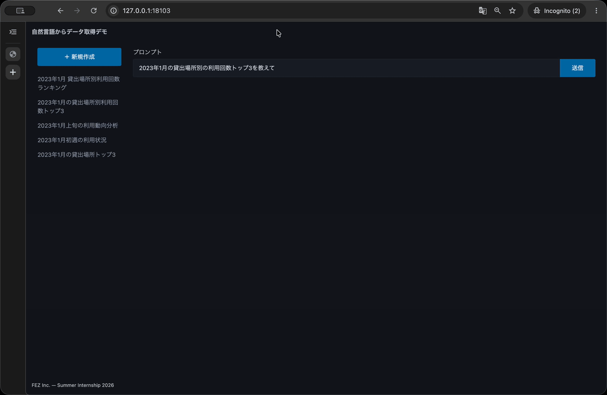

*図 7-6: 送信中にスピナーを表示する動作*

### 7.2.3 フォームの二重送信とアプリ内の画面遷移を防ぐ

フォームの無効化に加えて、アプリケーション自身でも送信中かどうかを管理します。`public/app.js` で次の行を検索します。

```javascript
const deleteSubmit = document.getElementById("delete-submit");
```

この行の直後、`async function loadList()` の直前へ、送信状態を表す変数を追加します。

```javascript
let isSubmitting = false;
```

`function setFormEnabled(enabled)` を検索します。この関数の閉じかっこの直後、`function highlightActive()` の直前へ、サイドバーにあるリンクの状態を切り替える関数を追加します。

```javascript
function setNavigationDisabled(disabled) {
  document.querySelectorAll("aside a[href^='/']").forEach((link) => {
    if (disabled) {
      link.setAttribute("aria-disabled", "true");
    } else {
      link.removeAttribute("aria-disabled");
    }
  });
}
```

`aside` 内にある新規作成ボタンとチャット履歴へ、まとめて `aria-disabled` を設定します。この属性は、リンクなどの要素が無効な状態であることを示します。リンク自体には `disabled` 属性がないため、クリック処理でも遷移を止めます。

`document.addEventListener("click", (event) => {` を検索します。このクリックイベントリスナーの中にある `event.preventDefault();` の直後へ、次の条件を追加します。

```javascript
if (isSubmitting) return;
```

最後に、`form.addEventListener("submit", async (event) => {` をもう一度検索します。この行から `loadList().then(route);` の直前にある対応する `});` まで、フォームの `submit` イベントリスナー全体を次の内容へ置き換え、`isSubmitting` とナビゲーションの切り替えを追加します。

```javascript
form.addEventListener("submit", async (event) => {
  event.preventDefault();

  if (isSubmitting) return;

  isSubmitting = true;
  setNavigationDisabled(true);

  try {
    promptSubmit.setAttribute("aria-busy", "true");
    setFormEnabled(false);

    const response = await fetch(API, {
      method: "POST",
      headers: { "Content-Type": "application/json" },
      body: JSON.stringify({ prompt: promptInput.value }),
    });
    const chat = await response.json();

    history.pushState({}, "", `/chat/${chat.id}`);
    await route();
  } finally {
    promptSubmit.removeAttribute("aria-busy");
    isSubmitting = false;
    setNavigationDisabled(false);
  }
});
```

イベントが重複して発生しても、`isSubmitting` が `true` の間は新しい POST リクエストを開始しません。`finally` ではスピナー、送信状態、ナビゲーションの順に元へ戻します。

もう一度質問を送信し、スピナーが表示されている間に入力欄、送信ボタン、新規作成ボタン、サイドバーの履歴を操作します。フォームを再送信できず、アプリ内の別画面へも移動しないことを確認してください。

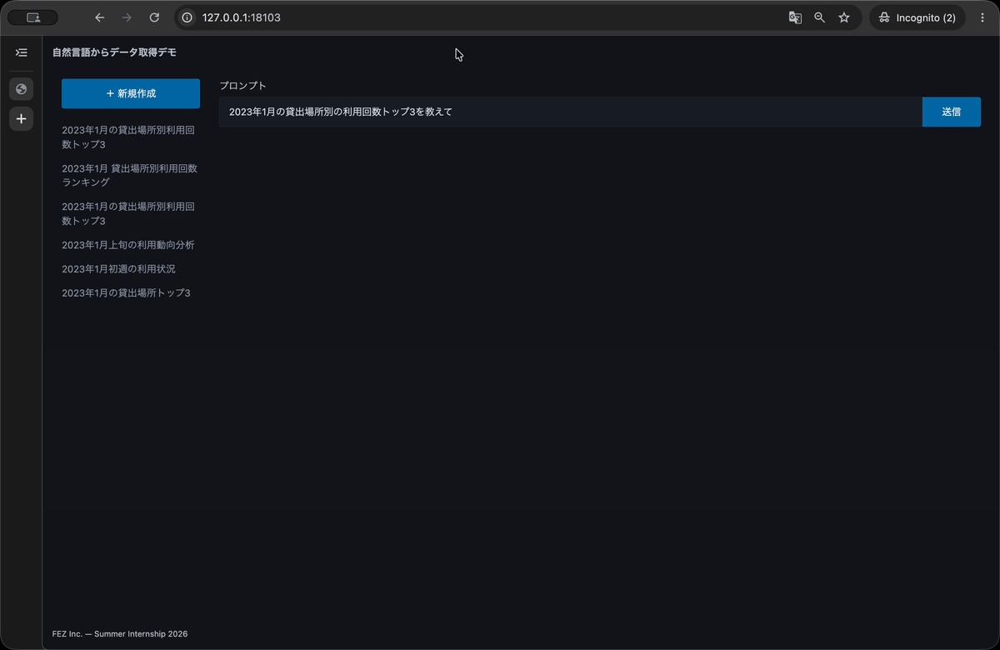

*図 7-7: 送信中にフォームとアプリ内ナビゲーションを無効にする動作*

### 7.2.4 ブラウザで送信中の画面状態を確認する

ファイルを保存し、ブラウザを更新します。その後、新規作成画面から分析できる質問を送信します。処理が完了するまで、次の状態になることを確認してください。

1. 送信ボタンにスピナーが表示される
2. 入力欄と送信ボタンを操作できない
3. 新規作成ボタンとサイドバーの履歴を選択できない
4. 送信ボタンを続けて押しても、チャットが重複して作成されない
5. 作成完了後はスピナーが消え、サイドバーを再び操作できる

`aria-disabled` の見た目はブラウザや Pico CSS の状態によって異なる場合があります。クリックしても URL と画面が変わらないことを、無効化できたかどうかの基準にしてください。

アプリ内リンクとは異なり、ブラウザの戻る・進むボタン自体を無効にはできません。送信中に履歴を移動した場合の競合は、次の節で作成結果の描画と一緒に扱います。

この節で変更した範囲を確認します。

```bash
git diff -- public/app.js
```

差分が次の変更だけになっていることを確認してください。

- `isSubmitting` で送信中かどうかを管理した
- `setNavigationDisabled` でサイドバーのリンクを無効化した
- 送信中のアプリ内リンクのクリックとフォームの二重送信を止めた
- `submit` イベントリスナーでスピナーとフォームの状態を切り替えた

差分に問題がなければ、この節の変更をコミットします。

```bash
git add public/app.js
git commit -m "feat: chat 作成中の状態表示を追加"
```

## 7.3 チャットの作成結果を画面と履歴へ反映する

現在の送信処理は、POST レスポンスを受け取った後に `route` を呼び出しています。`route` は作成したチャットを GET API でもう一度取得するため、POST ですでに受け取った同じデータを再取得しています。また、チャットの一覧を取得し直していないため、作成したチャットはページを再読み込みするまでサイドバーへ表示されません。

この節では、POST レスポンスをそのまま描画し、URL、分析結果、サイドバーを一連の作成結果として更新します。

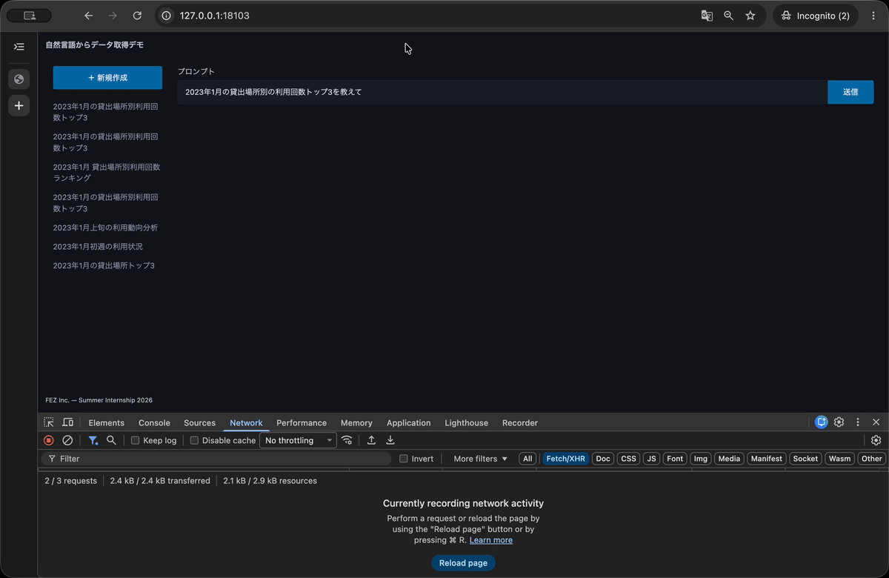

*図 7-8: POST のあとに詳細を GET し直す変更前の通信*

### 7.3.1 作成後に画面を更新する流れを確認する

チャットの作成成功後は、次の順序で画面を更新します。

1. POST レスポンスで作成されたチャットを受け取る
2. URL を作成されたチャットの `/chat/{id}` へ変更する
3. POST レスポンスから入力欄と分析結果を直接更新する
4. チャット一覧を再取得してサイドバーへ追加する
5. 作成したチャットをサイドバーの選択状態にする

ブラウザと API の通信、ブラウザ内の画面更新を並べると、次の流れになります。

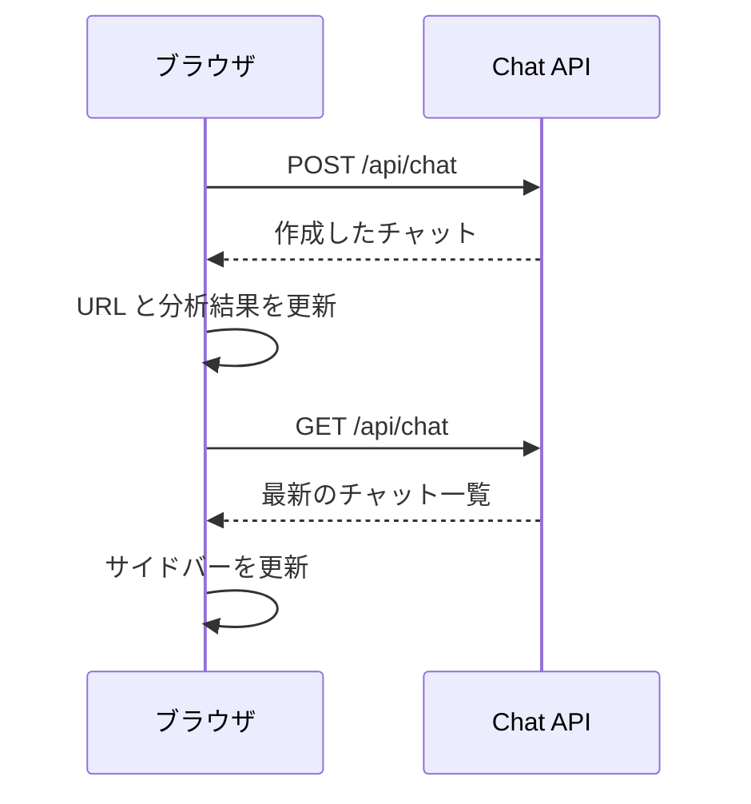

POST レスポンスからメイン画面を更新した後、GET API では作成したチャットの詳細ではなく一覧だけを取得します。

メイン画面とサイドバーは別々に更新します。サイドバーの再取得だけが失敗した場合でも、POST で作成できたチャットの結果はそのまま表示します。

### 7.3.2 POST レスポンスから結果を描画して URL を更新する

`public/app.js` で `form.addEventListener("submit", async (event) => {` を検索します。そのイベントリスナー内の `try` ブロックにある `const response = await fetch(API, {` から `await route();` までを、次の内容へ置き換えます。

```javascript
const response = await fetch(API, {
  method: "POST",
  headers: { "Content-Type": "application/json" },
  body: JSON.stringify({ prompt: promptInput.value }),
});
const chat = await response.json();

if (!response.ok) {
  throw new Error(`チャットの作成に失敗しました: ${response.status}`);
}

history.pushState({}, "", `/chat/${chat.id}`);
promptInput.value = chat.prompt;
render(chat);
setFormEnabled(false);
```

POST API は作成したチャットの `id`、`prompt`、`title`、`result` を返すため、詳細取得 API を呼び出さなくても画面を組み立てられます。`render(chat)` で分析結果を直接描画し、詳細画面と同じくフォームを読み取り専用の状態にします。

`response.ok` は、ステータスコードが `200` 番台の場合に `true` になります。失敗レスポンスをチャットとして描画しないため、ここではエラーを送出します。レスポンスの種類に応じた表示は、第 7.4 節で追加します。

ファイルを保存し、ブラウザの開発者ツールで Network パネルを開いてから質問を送信します。POST のレスポンスを受け取ると結果が表示され、同じチャットの詳細取得 API が続けて呼ばれないことを確認してください。

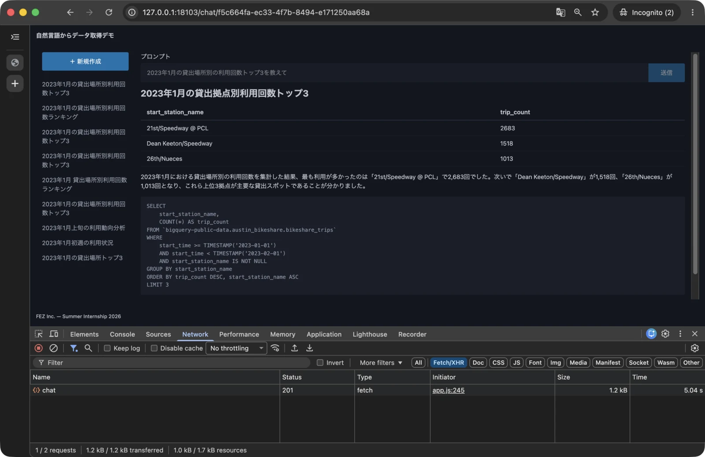

*図 7-9: POST レスポンスだけで結果を描画したあとの通信*

### 7.3.3 作成したチャットをサイドバーへ追加する

POST が成功したかどうかを `try` の終了後にも判定できるようにします。フォームの `submit` イベントリスナー内で `setNavigationDisabled(true);` を検索し、その直後にある `try {` の直前へ変数を追加します。

```javascript
let created = false;

try {
```

同じイベントリスナー内で `if (!response.ok) {` を検索します。この `if` ブロックの閉じかっこの直後、`history.pushState` の直前で、作成成功の状態へ変更します。

```javascript
created = true;
```

同じイベントリスナー内で、`setNavigationDisabled(false);` を含む `finally` ブロックを検索します。その `finally` ブロックの閉じかっこの直後、`submit` イベントリスナーを閉じる `});` の直前へ、サイドバーを更新する処理を追加します。

```javascript
if (created) {
  try {
    await loadList();
    highlightActive();
  } catch (error) {
    console.error(error);
  }
}
```

`loadList` が最新の一覧を取得し、作成したチャットをサイドバーへ追加します。一覧の要素を作り直した後に `highlightActive` を呼び、現在の URL と一致するチャットを選択状態にします。

サイドバーの更新は独立した `try` で囲んでいます。チャットの POST が成功した後に一覧の取得だけが失敗しても、作成結果や URL を失敗前の状態へ戻さず、エラーを開発者ツールへ記録します。

新規作成画面から質問を送信します。作成完了後に新しいチャットがサイドバーの先頭へ追加され、選択状態になることを確認してください。

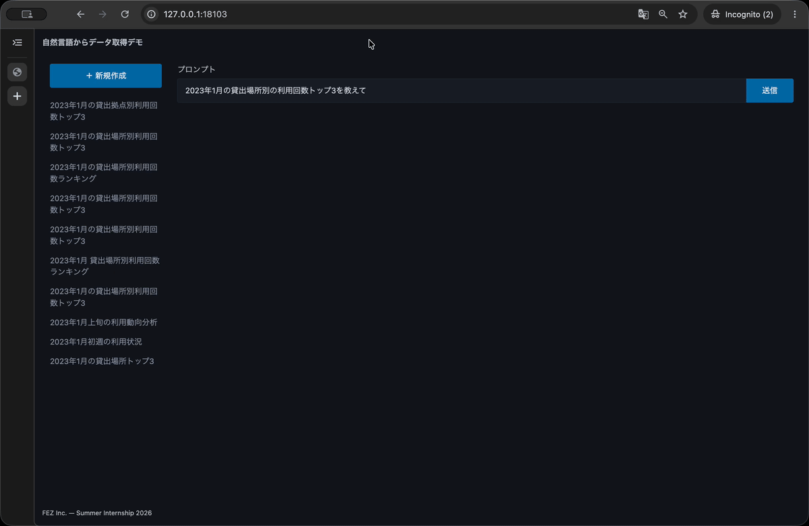

*図 7-10: 作成したチャットをサイドバーへ追加する動作*

### 7.3.4 履歴の移動後に作成結果で画面を上書きしないようにする

POST の待機中でも、ブラウザの戻る・進むボタンを押すことはできます。移動先を `route` で描画した後に POST が完了すると、作成結果によって移動先の画面を上書きする可能性があります。

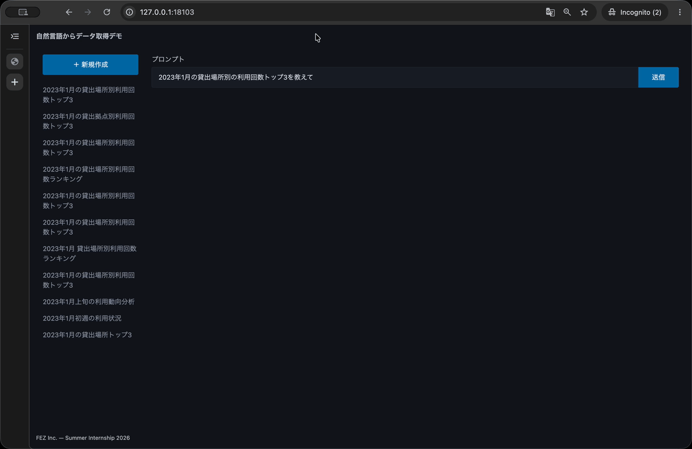

*図 7-11: 履歴移動後に作成結果で画面が上書きされる変更前の動作*

POST の結果を現在の画面へ反映してよいか、送信状態とは別の変数で管理します。`public/app.js` で `let isSubmitting = false;` を検索し、その直後へ `shouldApplyResult` を追加します。

```javascript
let isSubmitting = false;
let shouldApplyResult = false;
```

フォームの `submit` イベントリスナーを検索し、その中にある `isSubmitting = true;` の直後へ、結果を反映する状態を追加します。

```javascript
isSubmitting = true;
shouldApplyResult = true;
setNavigationDisabled(true);
```

同じイベントリスナーの `try` ブロックで、`created = true;` から `setFormEnabled(false);` までを検索します。POST 成功後にメイン画面を更新する部分を、次の条件付きの処理へ置き換えます。`created = true` は条件の外側に置き、画面を移動した場合でも作成成功の記録とサイドバーの更新は行います。

```javascript
created = true;

if (shouldApplyResult) {
  history.pushState({}, "", `/chat/${chat.id}`);
  promptInput.value = chat.prompt;
  render(chat);
  setFormEnabled(false);
}
```

フォームの `submit` イベントリスナーで、`promptSubmit.removeAttribute("aria-busy");` から始まる `finally` ブロックを検索し、ブロック全体を次の内容へ置き換えます。送信状態と一緒に反映可否も戻します。

```javascript
} finally {
  promptSubmit.removeAttribute("aria-busy");
  isSubmitting = false;
  shouldApplyResult = false;
  setNavigationDisabled(false);
}
```

`public/app.js` で `window.addEventListener("popstate", route);` を検索し、この 1 行を次のイベントリスナーへ置き換えます。

```javascript
window.addEventListener("popstate", () => {
  if (isSubmitting) {
    shouldApplyResult = false;
    promptSubmit.removeAttribute("aria-busy");
  }

  route();
});
```

送信中にブラウザ履歴を移動した場合は `shouldApplyResult` を `false` にし、POST 完了後のメイン画面更新を止めます。POST リクエスト自体は中断せず、成功時には作成したチャットをデータベースへ残し、サイドバーの一覧も更新します。

スピナーは移動前のフォームが処理中であることを示す表示なので、履歴を移動した時点で取り除きます。`finally` でも同じ属性を取り除きますが、存在しない属性を削除しても問題はありません。

ファイルを保存し、既存のチャットから新規作成画面へ移動して質問を送信します。スピナーの表示中にブラウザの戻るボタンを押し、POST が完了した後も移動先のチャットが作成結果で上書きされないことを確認してください。

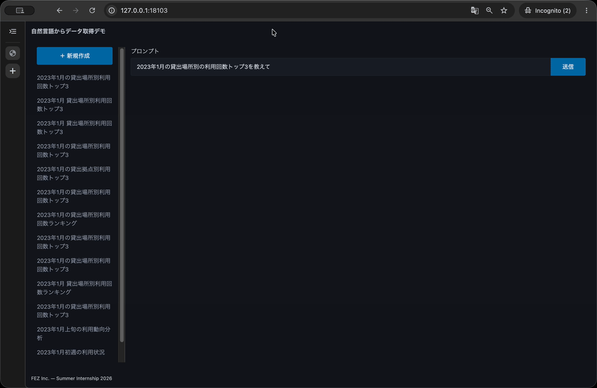

*図 7-12: 履歴移動後の画面を作成結果で上書きしない変更後の動作*

### 7.3.5 ブラウザで作成結果と履歴の更新を確認する

最初に、通常の作成完了時の動きを確認します。

1. 新規作成画面から分析できる質問を送信する
2. POST 完了後に URL が `/chat/{id}` へ変わる
3. ページ全体を再読み込みせず、質問、タイトル、表、要約、SQL が表示される
4. 作成したチャットがサイドバーの先頭へ追加され、選択状態になる
5. ブラウザの開発者ツールの Network で、POST の直後に同じチャットの GET API を呼び出していない

続けて、送信中にブラウザ履歴を移動した場合を確認します。

1. サイドバーの既存チャットを開き、「新規作成」を押す
2. 質問を送信し、スピナーが表示されている間にブラウザの戻るボタンを押す
3. 移動先の既存チャットが表示され、POST 完了後も作成結果で上書きされない
4. POST 完了後に、作成したチャットがサイドバーへ追加される
5. 追加されたチャットを選択すると、作成結果を表示できる

通常の作成と履歴移動時の動きを確認できたら、この節の差分を確認します。第 7.2 節の変更はすでにコミットしているため、ここでは作成完了後の描画と履歴更新だけが表示されます。

```bash
git diff -- public/app.js
```

差分が次の変更だけになっていることを確認してください。

- POST レスポンスからメイン画面を直接描画した
- `created` を使い、作成成功時だけサイドバーを再取得した
- `shouldApplyResult` で、履歴移動後の画面上書きを防いだ
- `popstate` で送信中の結果を現在画面へ反映しない状態へ切り替えた

差分に問題がなければコミットします。

```bash
git add public/app.js
git commit -m "feat: chat 作成結果と履歴更新を追加"
```

## 7.4 API のエラーを画面へ表示する

第 6 章では、SQL を生成できない質問に対して `422 Unprocessable Content` と拒否理由を返すようにしました。しかし、現在のフロントエンドは成功レスポンスと失敗レスポンスを区別せず JSON をチャットとして扱うため、ユーザーは拒否理由を確認できません。通信やサーバーで予期しない問題が起きた場合も、画面にはエラーが表示されません。

この節では、API の失敗を「SQL の生成拒否」と「予期しない失敗」に分けます。SQL の生成拒否では API が返した理由を表示し、それ以外では内部情報を含まない共通メッセージを表示します。

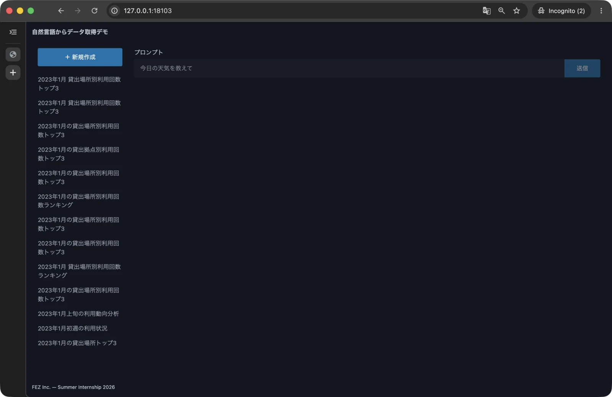

*図 7-13: SQL 生成拒否理由を画面へ表示する前の状態*

### 7.4.1 エラーメッセージの表示領域を追加する

エラーメッセージは、質問との関係が分かるように入力フォームの中へ置きます。`public/index.html` で `<input` の直後に `id="prompt"` がある入力欄を検索し、`name="prompt"` の直後へ `aria-describedby` を追加します。

```html
<input
  type="text"
  id="prompt"
  name="prompt"
  aria-describedby="invalid-helper"
  placeholder="例: 2023年1月の貸出場所別の利用回数トップ3は？"
/>
```

続けて、</fieldset> の直後へエラーメッセージの表示領域を追加します。

```html
</fieldset>
<small id="invalid-helper" role="alert"></small>
```

`aria-describedby` は、入力欄と補足メッセージを関連付けます。さらに表示領域へ `role="alert"` を設定し、内容が追加されたときに支援技術へ通知されるようにします。

`public/style.css` で `#prompt-submit` を検索します。このルールの閉じかっこの直後、`@media (max-width: 768px)` の直前へ、エラーメッセージの色を追加します。

```css
#invalid-helper {
  color: var(--pico-del-color);
}
```

`--pico-del-color` は、Pico CSS が削除やエラーの表現に使う色です。ライトモードとダークモードのどちらでも、テーマに対応した色が使われます。

`public/app.js` で次の行を検索します。

```javascript
const form = document.getElementById("data-fetch-form");
```

この行の直後へ `invalidHelper` を追加します。前後の行を含めると次の並びになります。

```javascript
const form = document.getElementById("data-fetch-form");
const invalidHelper = document.getElementById("invalid-helper");
const promptInput = document.getElementById("prompt");
```

別の画面へ移動した後に以前のエラーを残さないよう、`async function route()` を検索します。関数を開始する `{` の直後、`const match = location.pathname.match` の直前へ次の処理を追加します。

```javascript
async function route() {
  invalidHelper.textContent = "";
  promptInput.removeAttribute("aria-invalid");

  const match = location.pathname.match(/^\/chat\/(.+)$/);
```

フォームの `submit` イベントリスナーを表す `form.addEventListener("submit", async (event) => {` を検索します。その中にある `if (isSubmitting) return;` の直後、`isSubmitting = true;` の直前へ、以前のエラーを消す処理を追加します。

```javascript
if (isSubmitting) return;

invalidHelper.textContent = "";
promptInput.removeAttribute("aria-invalid");

isSubmitting = true;
```

入力値は消さず、メッセージとエラー状態だけを初期化します。エラー後に質問を修正して再送信する場合も、入力内容を引き継げます。

### 7.4.2 POST レスポンスを結果ごとに分類する

`POST /api/chat` のレスポンスを、次の 3 種類として扱います。

| 判定 | 意味 | 画面の動き |
|---|---|---|
| `response.ok` | チャットを作成できた | 作成結果、URL、サイドバーを更新する |
| `422` かつ `detail.code` が `SQL_GENERATION_DECLINED` | 質問から SQL を生成できなかった | API が返した拒否理由を表示する |
| 上記以外の失敗 | 通信、LLM、BigQuery、データベースなどの予期しない問題 | 共通のエラーメッセージを表示する |

ステータスコードが同じ `422` でも、FastAPI の入力検証エラーはレスポンスの形が異なります。`detail.code` まで確認することで、SQL の生成拒否だけをユーザーが修正できるエラーとして扱います。

予期しない失敗では、サーバーのレスポンス本文や JavaScript の例外をそのまま画面へ表示しません。詳細は開発者ツールへ記録し、画面には利用者向けの固定メッセージだけを表示します。

### 7.4.3 SQL の生成拒否理由を表示して再送信できるようにする

`public/app.js` で `form.addEventListener("submit", async (event) => {` を検索します。そのイベントリスナー内にある `try {` から、`finally {` の直前にある `try` ブロックの閉じかっこまでを、次の内容へ置き換えます。

```javascript
try {
  promptSubmit.setAttribute("aria-busy", "true");
  setFormEnabled(false);

  const response = await fetch(API, {
    method: "POST",
    headers: { "Content-Type": "application/json" },
    body: JSON.stringify({ prompt: promptInput.value }),
  });
  const data = await response.json();

  if (response.ok) {
    created = true;

    if (shouldApplyResult) {
      history.pushState({}, "", `/chat/${data.id}`);
      promptInput.value = data.prompt;
      render(data);
      setFormEnabled(false);
    }
  } else if (
    response.status === 422 &&
    data.detail?.code === "SQL_GENERATION_DECLINED"
  ) {
    if (shouldApplyResult) {
      invalidHelper.textContent = data.detail.message;
      promptInput.setAttribute("aria-invalid", "true");
      setFormEnabled(true);
    }
  } else {
    throw new Error(`チャットの作成に失敗しました: ${response.status}`);
  }
}
```

`try` ブロックの先頭に、第 7.2 節で追加したスピナーの表示とフォームの無効化を残しています。成功時は、これまでどおり作成結果を表示します。SQL の生成拒否では `detail.message` を入力欄の下へ表示し、`aria-invalid` で入力欄をエラー状態にします。フォームを有効に戻すため、ユーザーは拒否理由を確認し、質問を修正して再送信できます。

生成拒否では `history.pushState` や `render` を呼ばないため、現在の URL と入力内容は変わりません。`created` も `false` のままなので、サイドバーの更新には進みません。

送信中にブラウザ履歴を移動した場合は `shouldApplyResult` が `false` になっています。その場合は、移動先へエラーメッセージやフォーム状態を反映せず、現在の画面を維持します。

### 7.4.4 予期しない失敗を共通メッセージで表示する

フォームの `submit` イベントリスナーで、`try {` に対応する `finally {` を検索します。`try` ブロックの閉じかっこと `finally {` の間へ、次の `catch` を追加します。

```javascript
} catch (error) {
  console.error(error);

  if (shouldApplyResult) {
    invalidHelper.textContent =
      "予期せぬエラーが発生しました。開発者にお問い合わせください";
    setFormEnabled(true);
  }
} finally {
```

SQL の生成拒否以外の HTTP エラーは、前項の `throw new Error` から `catch` へ進みます。ネットワークエラーや JSON の読み取りに失敗した場合も同じ `catch` で処理します。例外の詳細は `console.error` で開発者ツールへ残し、画面では内部情報を含まない共通メッセージを表示します。

フォームを有効に戻し、URL と入力内容は変更しないため、問題が解消した後に同じ画面から再送信できます。

タイトルの更新とチャットの削除でも、予期しない失敗を同じメッセージで表示します。`function createActions(chat, heading)` を検索し、その中にある `edit.onclick = () => {` の直後へ、以前のエラーを消す処理を追加します。

```javascript
edit.onclick = () => {
  invalidHelper.textContent = "";
  titleInput.value = chat.title;
```

同じ `edit.onclick` の中で `titleSave.onclick = async () => {` を検索します。その中にある `try {` から、対応する `finally` ブロックの閉じかっこまでを次の内容へ置き換えます。

```javascript
try {
  titleSave.setAttribute("aria-busy", "true");

  const response = await fetch(`${API}/${chat.id}`, {
    method: "PUT",
    headers: { "Content-Type": "application/json" },
    body: JSON.stringify({ title }),
  });

  if (!response.ok) {
    throw new Error(`タイトルの更新に失敗しました: ${response.status}`);
  }

  chat.title = title;
  heading.textContent = title;
  await loadList();
  highlightActive();
} catch (error) {
  console.error(error);
  invalidHelper.textContent =
    "予期せぬエラーが発生しました。開発者にお問い合わせください";
} finally {
  titleSave.removeAttribute("aria-busy");
  titleDialog.close();
}
```

更新に失敗した場合は `chat.title` と画面の見出しを変更せず、モーダルを閉じて共通メッセージを表示します。成功時は詳細画面とサイドバーを更新してからモーダルを閉じます。

`function createActions(chat, heading)` の中で `remove.onclick = () => {` を検索します。この行から、`return actions;` の直前にある `};` までを次の内容へ置き換えます。

```javascript
remove.onclick = () => {
  invalidHelper.textContent = "";

  deleteSubmit.onclick = async () => {
    try {
      deleteSubmit.setAttribute("aria-busy", "true");

      const response = await fetch(`${API}/${chat.id}`, {
        method: "DELETE",
      });

      if (!response.ok) {
        throw new Error(`チャットの削除に失敗しました: ${response.status}`);
      }

      history.replaceState({}, "", "/");
      await loadList();
      await route();
    } catch (error) {
      console.error(error);
      invalidHelper.textContent =
        "予期せぬエラーが発生しました。開発者にお問い合わせください";
    } finally {
      deleteSubmit.removeAttribute("aria-busy");
      deleteDialog.close();
    }
  };

  deleteDialog.showModal();
};
```

削除に失敗した場合は URL、サイドバー、表示中のチャットを変更しません。成功した場合だけ新規作成画面へ移動します。どちらの場合も `finally` でスピナーを取り除き、確認モーダルを閉じます。

### 7.4.5 ブラウザで API エラー後の画面状態を確認する

最初に、SQL の生成拒否を確認します。新規作成画面から、ID-POS データでは回答できない質問を送信してください。

```text
今日の島根の天気を教えて
```

Gemini の判断によって文言は異なりますが、次の状態になれば SQL の生成拒否を処理できています。

1. 入力欄の下に「参照可能なデータがありません」などの拒否理由が表示される
2. 入力欄がエラー状態で表示される
3. 入力した質問と現在の URL が維持される
4. サイドバーに生成拒否したチャットが追加されない
5. 質問を分析可能な内容へ修正し、もう一度送信できる

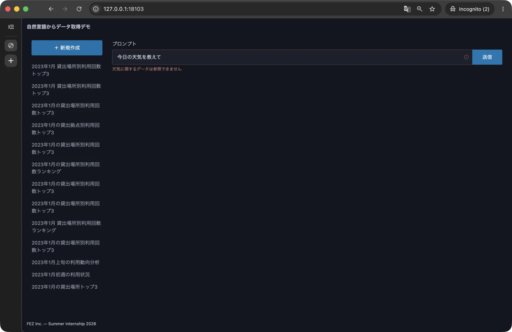

*図 7-14: SQL 生成拒否理由を入力欄の下へ表示した状態*

続けて、予期しない通信エラーを確認します。ブラウザの開発者ツールで Network パネルを開き、通信速度の設定を `Offline` にしてから質問を送信します。

1. 入力欄の下に「予期せぬエラーが発生しました。開発者にお問い合わせください」と表示される
2. 入力した質問と現在の URL が維持される
3. スピナーが消え、フォームとサイドバーを再び操作できる
4. Network パネルの設定をオンラインへ戻すと、質問を再送信できる

タイトルの更新またはチャットの削除でも、通信を `Offline` にした状態では共通メッセージが表示され、元のタイトルとチャットが維持されることを確認してください。確認後は、必ず Network パネルをオンラインへ戻します。

正常系と 2 種類のエラーを確認できたら、コミットの前にこの節の差分を確認します。

```bash
git diff -- public/index.html public/style.css public/app.js
```

差分が次の変更だけになっていることを確認してください。

- `public/index.html` に `invalid-helper` を追加し、プロンプトと関連付けた
- `public/style.css` でエラーメッセージの色を指定した
- `route` とフォーム送信前に以前のエラーを消した
- POST レスポンスを成功、SQL 生成拒否、その他の失敗に分類した
- POST、タイトル更新、チャット削除の予期しない失敗を共通メッセージで表示した

差分に問題がなければコミットします。

```bash
git add public/index.html public/style.css public/app.js
git commit -m "feat: SQL 生成拒否をフロントエンドに表示"
```

## 7.5 章全体を確認して変更をコミットする

最後に、変更した静的ファイルを含む Docker イメージを作り直し、最初から起動できることを確認します。Compose の起動ログを表示しているターミナルで `Control + C` を押してから実行してください。

```bash
docker compose rm -fsv
docker compose up --build
```

`Application startup complete.` と表示されたら、別のターミナルでコンテナの状態、テスト、ロックファイルを確認します。

```bash
docker compose ps
docker compose exec app uv run pytest
docker compose exec app uv lock --check
```

`docker compose ps` で `app` と `db` が起動し、`db` が `healthy` になっていることを確認します。続けて、第 6 章までに作成した 14 件のテストがすべて成功し、`uv lock --check` がエラーなく終了することを確認します。フロントエンドの構文エラーは、ブラウザを再読み込みしたときに開発者ツールの Console へ `SyntaxError` が出ていないことでも確認してください。

続けて、ブラウザで章全体の動作を一巡します。

1. チャットのタイトルを更新すると、詳細画面とサイドバーへ反映され、再読み込み後も保持される
2. チャットを削除すると、新規作成画面へ戻り、サイドバーとデータベースから削除される
3. 質問の送信中はスピナーが表示され、フォームの二重送信とアプリ内の画面遷移が防止される
4. 作成成功後は URL、質問、分析結果、サイドバーがページの再読み込みなしで更新される
5. 送信中にブラウザ履歴を移動しても、POST 完了後に移動先の画面が上書きされない
6. SQL を生成できない質問では拒否理由が表示され、質問を修正して再送信できる
7. 予期しない通信エラーでは共通メッセージが表示され、入力内容を保持したまま再操作できる
8. `docker compose ps` で `app` と `db` が起動し、`db` が `healthy` になっている

確認できたら、Compose の起動ログを表示しているターミナルで `Control + C` を押し、コンテナと Colima を停止します。

```bash
docker compose rm -fsv
docker compose down
colima stop
```

リポジトリのルートで、変更とコミットを確認します。

```bash
cd ~/Projects/fez-2026-summer-intern-public
git status
git log --oneline -4
git diff --check
```

`git status` に `nothing to commit, working tree clean` と表示され、最新の 4 件が次のコミットになっていることを確認します。

```text
feat: SQL 生成拒否をフロントエンドに表示
feat: chat 作成結果と履歴更新を追加
feat: chat 作成中の状態表示を追加
feat: フロントエンドでタイトル更新・チャット削除対応
```

変更がコミットされ、動作確認ができればこの章は完了です。タイトルの更新とチャットの削除を画面から操作でき、チャットの送信中、作成成功、SQL の生成拒否、予期しない失敗のそれぞれで適切な画面状態を表示できるようになりました。

おつかれさまでした！以上で実装パートは終了です。

余裕がある場合は、自分で考えて新しい機能を実装してみてもおもしろいかもしれません。
以下に、自由実装のテーマ例を示しておきますので参考にしてください。

- グラフを表示できるようにする
- チャットにメモを追加できるようにする
- SQL を手動で書き換えられるようにする
