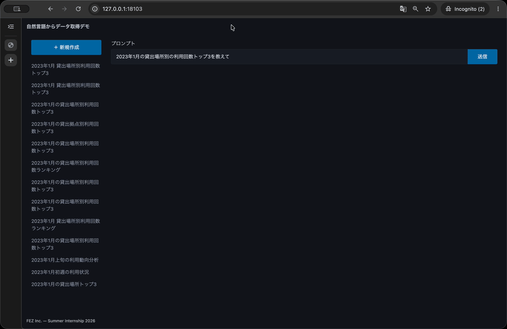

# 自然言語データ分析アプリを作る

## 概要

自然言語によるデータ分析アプリケーションを 0 から作る

## 進め方

| 章 | 内容 |
|---|---|
| [第 0 章: 事前準備](./00_setup.md) | 開発環境と Google Cloud を準備し、完成アプリを試す |
| [第 1 章: モックアプリ](./01_mock_app.md) | 固定データで API と画面をつなぐ |
| [第 2 章: Docker](./02_docker.md) | アプリをコンテナで動かす |
| [第 3 章: CRUD](./03_crud.md) | PostgreSQL にチャット履歴を保存する |
| [第 4 章: BigQuery](./04_bigquery.md) | 公開データを固定 SQL で集計する |
| [第 5 章: LLM](./05_llm.md) | 集計結果のタイトルと要約を生成する |
| [第 6 章: SQL 生成](./06_llm_sql.md) | 質問に合わせた SQL を生成する |
| [第 7 章: フロントエンド](./07_frontend.md) | 編集・削除、送信中・エラーの表示を整える |
