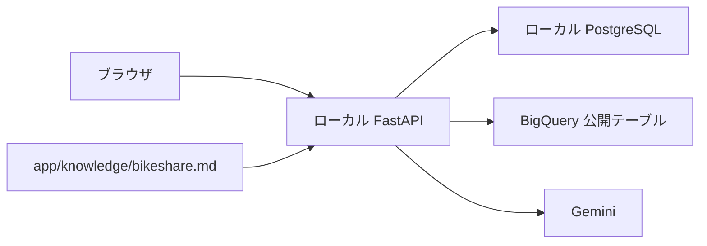

# 自然言語データ分析アプリ

自然言語の質問から Austin のシェアサイクル利用実績を BigQuery で集計し、結果の表・要約・実行 SQL を表示する完成アプリ

例: 「2023年1月の貸出場所別の利用回数トップ3を教えて」

## 構成



| 部分 | 使用する技術 |
|---|---|
| フロントエンド | JavaScript、Pico CSS |
| バックエンド | Python 3.13、FastAPI、SQLModel |
| チャットの保存 | Docker Compose の PostgreSQL |
| 集計 | BigQuery の Austin MetroBike 公開テーブル |
| SQL・タイトル・要約の生成 | Google Gen AI SDK、Gemini |

## 起動する

先に [第 0 章](../docs/00_setup.md) の手順で Google Cloud のプロジェクト作成・課金・API・ADC を準備する

```bash
cd ~/Projects/fez-2026-summer-intern-public/reference
cp .env.example .env
```

`.env` の `BIGQUERY_PROJECT_ID` と `GEMINI_PROJECT_ID` を自分の Google Cloud プロジェクト ID に置き換える

| 設定 | 初期値・指定方法 | 役割 |
|---|---|---|
| `BIGQUERY_PROJECT_ID` | 自分のプロジェクト ID を指定 | クエリ実行と課金 |
| `BIGQUERY_LOCATION` | `US` | 公開テーブルのロケーション |
| `GEMINI_PROJECT_ID` | 自分のプロジェクト ID を指定 | Gemini の利用 |
| `GEMINI_LOCATION` | `global` | モデルの提供先 |
| `GEMINI_MODEL` | `gemini-3.1-flash-lite` | SQL・タイトル・要約生成 |

データの所属先は `bigquery-public-data`、クエリの実行先は自分のプロジェクト。`.env` に公開データのプロジェクト ID を設定しない

```bash
colima start
docker compose config --quiet
docker compose up --build
```

- [アプリ](http://127.0.0.1:8000/)
- [Swagger UI](http://127.0.0.1:8000/docs)

ホストの ADC を読み取り専用でコンテナへマウントする。認証ファイルをこのリポジトリへコピーする必要はない

終了するときは `Control + C` を押し、`docker compose down` を実行する。履歴はボリュームへ保持するため、次回も同じ Compose プロジェクトで参照できる

## 実装の配置

| ディレクトリ | 役割 |
|---|---|
| `app/api/` | チャットの一覧・詳細・作成・更新・削除 |
| `app/schemas/` | API の入出力 |
| `app/models/` | DB に保存するモデル |
| `app/services/` | SQL 生成、集計、タイトル・要約生成 |
| `app/integrations/` | BigQuery と Gemini の通信 |
| `app/knowledge/` | 公開テーブルの列、期間、粒度、集計ルール |
| `public/` | 画面の HTML・CSS・JavaScript |

## 検証

```bash
docker compose exec app uv run pytest
```

単体テストは外部 API を呼ばず、型変換・実行制限・要約入力のサイズ制限・生成拒否後の停止を検証する

実接続は Swagger UI またはブラウザで確認する。日別集計、貸出場所ランキング、「今日の天気を教えて」の生成拒否を試す

BigQuery は本実行前に dry run を行い、SELECT と 1 GB 以下の処理量を確認する。実行時にも処理量の上限を設定する。これはクエリ単位の上限で、Google Cloud 全体の累計費用の上限ではない

公開データの期間・単位・出典は [データの説明](../docs/data.md) と [knowledge](app/knowledge/bikeshare.md) を参照する

## 利用するアカウント

この教材では、機密データへのアクセス権限を持たない Google アカウントを使用します。新しい課金用プロジェクトを作っても、同じアカウントが既存のプロジェクトやデータに持つ権限は変わりません。業務用データへアクセスできるアカウントは使わず、必要に応じて学習用のアカウントを用意してください。

標準実装は SELECT と処理データ量を確認しますが、参照先のテーブルは制限しません。取得した結果は画面表示・ローカル DB 保存に使われ、その一部を Gemini へ送って要約します。
